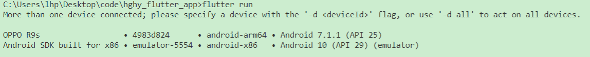

<!--
 * @Description: In User Settings Edit
 * @Author: your name
 * @Date: 2019-09-23 18:08:12
 * @LastEditTime: 2019-09-23 18:08:12
 * @LastEditors: your name
 -->
## 环境配置

### vscode中安装flutter插件

在扩展中搜索flutter并安装，会连dart插件一起安装

### 在Android Studio中安装flutter插件

启动Android Studio，选择configure中的plugins，搜索安装flutter，会连dart插件一起安装

### 安卓sdk配置

在`我的电脑`的环境变量中添加变量名`ANDROID_HOME`,变量值为sdk安装路径

### 关于 Android licenses not accepted

在flutter安装目录下双击flutter_console.bat文件，控制台打开后执行`flutter doctor --android-licenses`，后出现的内容直接输入`y`回车

## 打包



```dart
flutter run 4983d824
```

### 打包成apk安装后不能请求网络

在`android`目录文件下的`src`目录中存在3个子文件夹。每个子文件下都有一个`AndroidManifest.xml`文件，

对比发现`main`文件夹的`AndroidManifest.xml`文件中少了一个权限

```xml
<!-- 
	在manifest标签中添加下面标签，与application标签同级，添加后重新打包后问题解决
-->
<uses-permission android:name="android.permission.INTERNET"/>
```

### 打包事项

#### 安卓

[参考]( https://flutter.dev/docs/perf/app-size)

- 打包为android32位设备适用的apk

```dart
flutter build apk --target-platform=android-arm
```

- 打包为android64位设备适用的apk

```dart
flutter build apk --target-platform=android-arm64
```

- 分别打包为android64位设备和android32位设备的apk

```dart
flutter build apk --split-per-abi
```

> 不要在flutter1.9版本及以上直接使用flutter build apk打包，会将32位和64位文件都打包到一个apk文件中，造成文件体积过大

#### 修改打包后安装程序名

修改`android/app/src/main/AndroidManifest.xml`文件中的`application`标签属性`android:label`

```dart
<application
        android:name="io.flutter.app.FlutterApplication"
        android:label="hghy_flutter_app"
</application>   
```

#### 安装后显示图标

修改`android/app/src/main/AndroidManifest.xml`文件中的`application`标签属性`android:icon`

```dart
<application
        android:name="io.flutter.app.FlutterApplication"
        android:icon="@mipmap/ic_launcher"
</application>  
```


#### 设置启动动画

[参考]( https://flutter.dev/docs/development/ui/splash-screen/android-splash-screen)

  

## dart语法

### 变量

```dart
var name = 'dd'  //使用var定义一个变量 
final String name = 'dd'  //使用final定义一个变量，该变量只能赋值一次,有类型注释
final name1 = 'cc' // 无类型注释
const name = 'dd'  //使用const定义一个变量，该变量是编译时常量
const baz = const [] //使用const定义一个变量,值类型为const
final bar = const [] //使用final定义一个变量,值类型为const 
```

> 所有没有初始化的变量自动获取一个默认值为 `null`
>
> Const 变量是隐式 final 变量，`const` 关键字不仅仅只用来定义常量，还能定义一个值、构造函数为 const 类型
>
> 不能改变const和final定义的变量的值，可以改变非const和final定义的变量的值，即使值类型为const

类型检测使用`is`，类型转换使用`as`，扩展运算符`...`

```dart
const i = 3
const list = [i as int]  //使用类型转换
const map = {if(i is int) i:'int'}  //使用类型检测
const arr = [...list]   //使用扩展运算符
const arr1 = [...?list]  //若list为null则不执行扩展
```

### 内置类型

- numbers(数值): 分为 `int（整数值）`，  `double（浮点数或双精度值）`，如果一个数带小数点，则其为 double

- strings（字符串）：使用单引号或者双引号来创建字符串

  - 在字符串中可以使用表达式，语法： `${`*expression*`}`，若表达式为一个变量，可以省略`{}`,若是一个对象，则会调用对象的toString()方法获取一个字符串
  - 字符串连接使用`+`或相邻字符串，多行字符串需要使用**3重**单引号或者双引号
  - 通过提供一个 `r` 前缀可以创建一个 “原始 raw” 字符串

  ```dart
  var s1 = 'strings'
  var s2 = 'this is $string' //表达式为变量，省略{}
  var s3 = '3+3=${3+3}'   //表达式
  var s4 = 'this'+'is' //+连接字符串
  var ss = 'this'
    				'is'   //相邻字符串连接
  var s5 = """This is also a
  				multi-line string."""  //使用3重"""创建多行字符串
  var s6 = r"In a raw string, even \n isn't special."  //r前缀创建原始字符串
  ```

- booleans：`true`和`false`,只有 `true` 对象才被认为是 true，其他的非bool类型值都是 flase，和 Js 不一样

- lists(Arrays)：dart中的数组，和js中类似

```dart
var list = [1,2,3]   //通过字面量的形式创建数组
var Array = [...list]  //使用扩展运算符将list中的内容插入
var arr = [1,2,if(tag) 3]  //使用条件判断，根据tag值来判断是否创建该条内容
var arrs = [1,2,for(var i in list) '$i']  //使用for in将list中的内容添加到arrs中
```

- sets:包含在一对`{}`中的无序的值类型相同的集合，支持`扩展运算符`和`if`和`for in`使用与数组类似

```dart
var set = <String>{}  //定义一个set空集合，值类型为String
Set<String> names = {} //空使用set关键字定义空集合
var set1 = {'yellow','blue','red'}  //定义一个set集合，自动检测值类型为String
set.add('white')  //使用add()添加值
set.addAll(set1)  //使用addAll()将set1中的值添加到set中
set.length   //查看set中的数目
```

> 定义一个空set集合时，必须在值前定义值类型或者变量前使用set关键字，否则定义的是一个map而不是set集合

- maps：一个键值对相关的对象, 键和值可以是任何类型的对象。每个 *键* 是唯一的, 而值则可以出现多次，类似于js中的对象

  - 创建一个map字面量，类似于js中创建一个对象字面量
  - 使用 Map 构造函数创建map实例，类似于js中用`new Object()`创建一个对象
  - 添加新的键值对和js中对象添加属性一样，访问键值对时使用`[]`，访问不存在的键值对返回null

  ```dart
  var people = {'name': 'gg','age':'18'}  //使用字面量创建map
  var other = new Map()    //使用map构造函数创建map
  other['name'] = 'cc'  //添加键值对
  other.length       //使用length属性获取map中键值对的数目
  final man = const {'name':'dd'}  //使用const创建一个 编译时常量的 map
  ```

  > 在map中编译器会自动推断键和值的类型，键类型必须一致，值类型必须一致，否则出错

- runes:代表字符串的 UTF-32 code points,通常使用 `\uXXXX` 16进制的方式来表示 Unicode code point

```dart
var clapping = '\u{1f44f}'
Runes input = new Runes('\u2665 \u{1f605} \u{1f60e} \u{1f47b} \u{1f596} \u{1f44d}')
```

- symbols： Dart 程序中声明的操作符或者标识符,使用`#name`的形式产生一个symbol，

### 函数

函数也是对象并且具有一种类型`function`，函数可以赋值给变量，也可以当做其他函数的参数

```dart
bool fn1(){return false}   //定义一个返回值为bool类型的函数
fn2(){..}  //忽略返回值类型
fn3()=>false   //对于只有一个表达式的方法可以选择使用缩写语法来定义，=>expr是{return expr}的缩写
```

方法可以有两种类型的参数：必需的和可选的。 必需的参数在参数列表前面， 后面是可选参数

```dart
fn(arg1:true,arg2:false)   //在函数调用时，通过键值对的形式，设置参数值
fn1(bool arg1, bool arg2){}   //通过定义变量的形式，来指定参数值的类型
fn2(bool arg1, [bool arg2]){}   //将参数放在[]中为可选参数
fn3({bool arg1, @required bool arg2}){}  //@required指定的参数在函数调用时，必须传递一个值
fn4({bool arg1=true,bool arg2 = false}){}   //在定义函数时，使用=设置参数的默认值
```

函数传参与js类似，匿名函数定义不需要关键字function，函数表达式与js类似

如果函数没有返回值，则返回null

### 运算符

基本算数操作：

| Operator | Meaning    |
| :------: | :--------- |
|    +     | 加         |
|    -     | 减，负号   |
|    *     | 乘         |
|    /     | 除         |
|    ~/    | 除（取整） |
|    %     | 取余数     |

类型操作符：

| Operator | meaning  |                   使用                   |
| :------: | -------- | :--------------------------------------: |
|    as    | 类型转换 |    age as int   (将age转化为int类型)     |
|    is    | 类型判断 |    age is int  (判断age是否为int类型)    |
|   is!    | 类型判断 | age is! int  ((判断age是否*不*为int类型) |

赋值操作：`??=`  如果左侧变量值为nul，则将右侧值赋值给该变量，否则左侧变量值不变

条件表达式：

| Opertor | meaning                                                      |
| :-----: | ------------------------------------------------------------ |
|   ??    | 如果左侧表达式结果不为null，则返回左侧表达式的值，否则返回右侧表达式的值 |
|   ?:    | 三元表达式与js中类似                                         |

级联操作符： **`..`**允许对同一对象执行一系列操作，类似于js中的`·`访问对象属性

其他操作符：**`?.`**属性访问，当左侧对象不为null时，才访问该对象中符号右侧的的属性

### 类

声明一个类，类的构造函数与类同名，若未声明构造函数，则自动提供一个默认构造函数

```dart
class Point {
  num x, y;
  Point(num x, num y) {
    this.x = x;
    this.y = y;
  }
}
```

所有实例变量都生成一个隐式getter方法。非最终实例变量也会生成隐式setter方法。

#### 命名构造函数

在构造函数后使用`.name`的形式为该构造函数命名

```dart
class Point {
  num x;
  num y;
  Point(this.x, this.y); //直接将传入的参数值赋值给x、y
  Point.fromJson(Map json) {  //命名构造函数
    x = json['x'];
    y = json['y'];
  }
}
```

#### 继承

使用extends创建一个子类，使用super来调用父类构造函数。

在子类继承父类时，若父类中没有无名无参数的构造函数，则必须在子类构造函数名后使用`:`调用父类中的其他构造函数

```dart
class Person {
  String firstName;
  Person.fromJson(Map data) {  //命名构造函数
    print('in Person');
  }
}
class Employee extends Person {  //继承
  Employee.fromJson(Map data) : super.fromJson(data) { //调用父类其他构造函数
    print('in Employee');
  }
}
```

#### 初始化列表

可以在构造函数体运行之前初始化*实例变量*,

```dart
Point.fromJson(Map<String, num> json): x = json['x'],y = json['y'] {  //xy为内部变量
  print('In Point.fromJson(): ($x, $y)');
}
```

#### 重定向构造函数

构造函数可以重定向到同类中的其他构造函数，重定向构造函数的函数体是空的，构造函数调用出现在**`:`**之后

```dart
class Point {
  num x, y;
  Point(this.x, this.y);  //主构造函数
  Point.alongXAxis(num x) : this(x, 0);  //重定向构造函数，重定向到主构造函数
}
```

#### 常量构造函数

如果类生成的是不改变的对象，可以把这些对象 定义为编译时常量，使用const定义构造函数使用final定义实例变量

```dart
class ImmutablePoint {
  final num x, y;
  const ImmutablePoint(this.x, this.y);
  static final ImmutablePoint origin = const ImmutablePoint(0, 0);
}
```

#### 工厂构造函数

一个构造函数并不总是返回一个新的对象,则使用`factory`关键字定义构造函数，工厂构造函数可以从缓存中返回一个实例或子类实例，工厂构造函数不能使用`this`

```dart
class Logger {
  final String name;
  bool mute = false;
  // _cache is library-private, thanks to the _ in front of its name.
  static final Map<String, Logger> _cache = <String, Logger>{};
  factory Logger(String name) {    //工厂构造函数
    return _cache.putIfAbsent(name, () => Logger._internal(name));
  }
  Logger._internal(this.name);
  void log(String msg) {
    if (!mute) print(msg);
  }
}
```

#### 实例方法

在类中定义方法，该方法可以访问实例中的变量和`this`

#### Getters|Setters

getter和setter是提供对象属性的读写访问权限的特殊方法,通过`set`和`get`关键字定义属性

```dart
class Rectangle {
  num left, top, width, height;
  Rectangle(this.left, this.top, this.width, this.height);
  // Define two calculated properties: right and bottom.
  num get right => left + width;   //获取right时调用
  set right(num value) => left = value - width;   //设置right时调用
  num get bottom => top + height;
  set bottom(num value) => top = value - height;
}
```

#### 抽象方法

实例函数、 getter、和 setter 函数可以为抽象函数， 抽象函数是只定义函数接口但是没有实现的函数，由其他类来实现该方法，**抽象方法只能存在于抽象类中**,要使方法抽象，请使用`;`而不是函数体。使用`abstract`关键字定义抽象方法和抽象类

```dart
abstract class Doer {   //抽象类
  void doSomething(); // 定义一个抽象方法
}
class EffectiveDoer extends Doer {
  void doSomething() {   //在子类中实现
    ...
  }
}
```

> 抽象类不能实例化，只负责提供接口

#### 接口

每个类都隐式的定义了一个包含所有实例成员的接口， 并且这个类实现了这个接口，一个类可以通过 `implements` 关键字来实现一个或者多个接口， 并实现每个接口定义的 API

```dart
class Person {
  // In the interface, but visible only in this library.
  final _name;
  // Not in the interface, since this is a constructor.
  Person(this._name);
  // In the interface.
  String greet(String who) => 'Hello, $who. I am $_name.';
}
// An implementation of the Person interface.
class Impostor implements Person {
  get _name => '';
  String greet(String who) => 'Hi $who. Do you know who I am?';
}
class Point implements Comparable, Location {...}  //实现多个接口
```

#### 重写成员

在子类中可以使用`@override `来重写实例中的方法、getter、setter，在类型安全的代码中缩小方法参数或实例变量的类型，可以使用`covariant`关键字

```dart
class SmartTelevision extends Television {
  @override
  void turnOn() {...}
}
class Animal {
  void chase(Animal x) { ... }
}
class Cat extends Animal {
  void chase(covariant Mouse x) { ... }
}
```

#### 重写运算符

使用`operator `关键字后跟`重写的运算符`,以函数的形式重写运算符

```dart
class Vector {
  final int x, y;
  Vector(this.x, this.y);
  Vector operator +(Vector v) => Vector(x + v.x, y + v.y); //重写 +，返回的也是Vector类型
  Vector operator -(Vector v) => Vector(x - v.x, y - v.y); //重写 -
}
void main(){
	final sum = Vector(2,3) + Vector(1,4)  //使用重写后的 +，Vector(1,4)为重写运算符时参数v
  final sub = Vector(2,3) - Vector(1,4)  //使用重写后的 -，
}
```

#### noSuchMethod

在代码尝试使用不存在的方法或实例变量时检测或做出反应，可以重写noSuchMethod方法

```dart
class A {
  // Unless you override noSuchMethod, using a
  // non-existent member results in a NoSuchMethodError.
  @override
  void noSuchMethod(Invocation invocation) {
    print('You tried to use a non-existent member: ' +
        '${invocation.memberName}');
  }
}
```

#### 枚举类型

使用enum关键字声明一个枚举类型,每个枚举值都有一个索引`index`（从0开始）,可以以数组的形式访问枚举成员

```dart
enum Color { red, green, blue }
Color.red.index  // 0 
Color[2]  //blue
```

> 枚举不能有子类、混合、接口实现和实例化

#### mixins混合

将多个类的代码混入到一个类中，使用关键字`with`后面跟一个或多个混合类，混合类使用`mixin`代替`class`定义且不能有构造函数，如果混合类需要使用其他类中的方法使用`on`关键字类似于`extends` 

```dart
class Musician extends Performer with Musical {   //混入一个类
  // ···
}
class Maestro extends Person with Musical, Aggressive, Demented {  //混入多个类
  Maestro(String maestroName) {
    name = maestroName;
    canConduct = true;
  }
}
mixin Musical {...}  //定义混合类
mixin MusicalPerformer on Musician {  //使用其他类的方法
  // ···
}
```

#### 类的变量和方法

使用关键字`static`定义静态变量和静态方法，

静态变量在使用之前不会初始化，

在实例中不能通过`this`关键字访问静态方法，只能通过类名来访问

```dart
class Queue {
  static const initialCapacity = 16;  //静态变量
  // ···
}
class A {
   static fn(){}    //静态方法
}
A.fn()    //通过类名访问静态方法
```

### 泛型

在定义值类型和抽象类时，在一对`<>`中定义类型；`<>`中的类型为泛型参数

泛型可以检测代码安全，降低代码重复，泛型可以在多种类型之间共享单个接口和实现

```dart
var names = <String>['Seth','Kathy','Lars']//定义一个数组，数组中的值必须是String类型否则出错
var uniqueNames = <String>{'Seth', 'Kathy', 'Lars'} //定义一个set集合
var pages = <String, String>{'index.html': 'Homepage'}   //定义一个map键值对集合
abstract class Cache<T> {   //定义抽象类，T相当于类型的占位符
  T getByKey(String key);    //在子类中实现该接口时，自行指定返回值类型
  void setByKey(String key, T value);
}
```

在构造函数使用泛型指定参数类型，`<>`需要跟在类名后

```dart
var nameSet = Set<String>.from(names);  //使用set的命名构造函数
var names = List<String>()   //使用List构造函数，创建一个数组
var views = Map<int, View>();   //使用Map构造函数，键为整型，值为View类型
```

#### 限制泛型参数类型

限制参数类型使用`extends`,在使用构造函数时，泛型参数可以是泛型占位符继承的类或其子类或不指定泛型参数

```dart
class Foo<T extends SomeBaseClass> {  //指定泛型参数的限制类
  // Implementation goes here...
  String toString() => "Instance of 'Foo<$T>'";
}
class Extender extends SomeBaseClass {...}  //限制类的子类
var someBaseClassFoo = Foo<SomeBaseClass>(); //泛型参数为限制类
var extenderFoo = Foo<Extender>();   //泛型参数为限制类的子类
var foo = Foo()   //不指定泛型参数
```

> **指定了泛型参数限制类后，使用构造函数时要么不使用泛型参数，否则泛型参数必须是限制类或其子类**

#### 泛型函数

允许方法和函数的参数使用泛型

```dart
T first<T>(List<T> ts) {   //first<T> 允许返回值使用T 参数使用List<T> 变量使用T
    T tmp = ts[0];
    return tmp;
}
```

### 库和可见性

引入内置库URI 使用特殊的 `dart:` scheme，对于其他库可以使用*文件系统路径*或者 `package:` scheme

```dart
import 'dart:html'   //引入内置库
import 'package:test/test.dart';  //其他库
```

#### 库别名

当两个库中的方法或变量存在冲突时，在引入库时使用关键字`as`为库指定别名

```dart
import 'package:lib1/lib1.dart';
import 'package:lib2/lib2.dart' as lib2;
// Uses Element from lib1.
Element element1 = Element();
// Uses Element from lib2.
lib2.Element element2 = lib2.Element();
```

#### 引入库部分内容

如果只想使用库的一部分，则可以有选择地导入库，

关键字`show`引入库中指定的内容，关键字`hide`引入库中其他内容

```dart
import 'package:lib1/lib1.dart' show foo;  //只引入库中的foo
import 'package:lib2/lib2.dart' hide foo;		//引入库中除foo外的所有内容
```

#### 库懒加载

库的懒加载必须在引入库时使用`dedeferred as`,使用库时需要先调用该库的`loadLibrary()`方法

```dart
import 'package:greetings/hello.dart' deferred as hello;
Future greet() async {
  await hello.loadLibrary();   //调用loadLibrary方法，可以多次调用该方法，库只加载一次
  hello.printGreeting();
}
```

> 在flutter、dart vm、dartdevc 中不支持库的懒加载

### 异步

使用`async`定义异步函数,`await`必须用于使用`async`定义的函数或其他异步函数

```dart
Future checkVersion() async {    //声明异步方法
  var version = await lookUpVersion();   //
}
await for (varOrType identifier in expression) {  //异步for循环
  // Executes each time the stream emits a value.
}
```

### 生成器

需要懒惰地生成一系列值时，可以使用生成器函数，

定义一个同步生成器函数使用`sync*`,异步使用`async*`。

使用`yield` 关键字来控制函数体中语句的执行，每调用一次函数执行一条`yield`语句

```dart
Iterable<int> naturalsTo(int n) sync* {  //同步生成器函数
  int k = 0;
  while (k < n) yield k++;
}
Stream<int> asynchronousNaturalsTo(int n) async* {   //异步
  int k = 0;
  while (k < n) yield k++;
}
```

若生成器函数是递归的，则使用`yield*`

```dart
Iterable<int> naturalsDownFrom(int n) sync* {
  if (n > 0) {
    yield n;
    yield* naturalsDownFrom(n - 1);
  }
}
```

### 可调用的类

要使`类的实例`可以向函数一样调用，需要在类的内部实现一个`call()`方法

```dart
class WannabeFunction {
  call(String a, String b, String c) => '$a $b $c!';
}
main() {
  var wf = new WannabeFunction();
  var out = wf("Hi", "there,", "gang");
  print('$out');
}
```

### Typedef

当把一个函数分配给变量时，函数返回值类型会丢失，使用`typedef`会保留类型信息

```dart
class SortedCollection {
  Function compare;
  SortedCollection(int f(Object a, Object b)) {
    compare = f;   //compare函数的返回类型丢失
  }
}

typedef Compare = int Function(Object a, Object b);
class SortedCollection {
  Compare compare;
  SortedCollection(this.compare);
}

typedef Compare<T> = int Function(T a, T b);
int sort(int a, int b) => a - b;
void main() {
  assert(sort is Compare<int>); // True!
}
```

### 元数据

使用元数据提供有关代码的其他信息。元数据注释以字符@开头，后跟对编译时常量的引用或对常量构造函数的调用，如：`@deprecated`，`@override`

```dart
library todo;
class Todo {
  final String who;
  final String what;
  const Todo(this.who, this.what);
}

import 'todo.dart';
@Todo('seth', 'make this do something')
void doSomething() {
  print('do something');
}
```

### 注释

单行注释：`//`

多行注释：`/* */`

文档注释：`///`或`/**`,编译器会忽略括号外的文档注释

```dart
void main() {
  //单行注释
  print('Welcome to my Llama farm!');
   /*
   * 多行注释
   */
   ///文档注释
}
```

## dart核心库

| 库              |                                                        |    适用平台    |
| :-------------- | ------------------------------------------------------ | :------------: |
| dart:async      | 支持异步编程                                           |      All       |
| dart:collection | 在dart：core中补充集合支持的类和实用程序               |      All       |
| dart:convert    | 用于在不同数据之间转码                                 |      All       |
| dart:core       | 内置类型，集合和其他核心功能，该库自动导入每个Dart程序 |      All       |
| dart:developer  | 与开发人员工具（如调试器和检查器）交互                 |    Web/JIT     |
| dart:html       | 基于Web的应用程序的HTML元素和其他资源                  |      web       |
| dart:indexed_db | 支持索引的客户端键值存储                               |      web       |
| dart:io         | 对非web应用支持flie、socket、HTTP、其他i/o             |   JIT / AOT    |
| dart:isolate    | 使用隔离的并发编程                                     |   JIT / AOT    |
| dart:js         | 建议使用js package代替                                 |      Web       |
| dart:js_util    | 建议使用js package代替                                 |      web       |
| dart:math       | 数学常数和函数，加上随机数生成器                       |      All       |
| dart:typed_data | 有效处理固定大小数据和SIMD数字类型的列表               |      All       |
| dart:web_audio  | 浏览器中的高保真音频编程                               |      web       |
| dart:web_gl     | 浏览器中3D编程                                         |      web       |
| dart:web_sql    | 在浏览器中存储可以使用SQL查询的数据的API               | Web (obsolete) |

### dart:core

#### 数字操作

print() :输出内容到控制台

parse():用于将字符串数字转换成数字，或数字的进制转换

```dart
int.parse('42') == 42
int.parse('0x42') == 66
double.parse('0.50') == 0.5
num.parse('42') is int
int.parse('42', radix: 16) == 66   //转换成16进制
```

toString():将数字转换成字符串数字

toStringAsFixed():指定小数点右边的位数

toStringAsPrecision():指定字符串中的有效位数

```dart
42.toString() == '42'
123.456.toString() == '123.456'
123.456.toStringAsFixed(2) == '123.46'
123.456.toStringAsPrecision(2) == '1.2e+2'  
```

#### 字符串操作

```dart
assert('Never odd or even'.contains('odd'));// contains检测字符串中是否包含指定字符串
assert('Never odd or even'.startsWith('Never'));//startsWith检测字符串是否以指定字符串开始 
assert('Never odd or even'.endsWith('even'));// endsWith检测字符串是否以指定字符串结尾
assert('Never odd or even'.indexOf('odd') == 6); // indexOf检测指定字符串的位置索引

assert('Never odd or even'.substring(6, 9) == 'odd') //substring截取指定位置的字符串
var parts = 'structured web apps'.split(' ')  //split以参数分割字符串，返回一个数组
'  hello  '.trim() == 'hello'  //trim()除去字符串开始和结尾的空白
assert(''.isEmpty)  //isEmpty检测字符串是否为空
assert(''.isNotEmpty) //isNotEmpty检测字符串不为空
  
'Hello, NAME!'.replaceAll(RegExp('NAME'), 'Bob') //replaceAll(）替换字符串内容
 RegExp(r'\d+').hasMatch('15 to 20')  //hasMatch检测正则是否匹配字符串
 for (var match in numbers.allMatches('15 to 20')) { //allMatches()循环检测
  print(match.group(0)); // 15, then 20
}
```

toUpperCase（）toLowerCase()：字符串大小写转换

#### 集合操作

list数组操作：

```dart
var fruits = ['apples', 'oranges']
fruits.add('kiwis')   //add()添加一个
fruits.addAll(['grapes', 'bananas']  //添加多个
fruits.indexOf('apples')   //返回索引
fruits.sort()   //数组排序             
fruits.length              //返回数组数目
fruits.clear()           //清除数组中所有项
fruits.isEmpty     //检测数组是否为空
```

set集合操作：

```dart
var ingredients = Set()
ingredients.addAll(['gold', 'titanium', 'xenon'])
ingredients.add('gold')  //添加重复项无效
ingredients.remove('gold') //移除指定项
ingredients.length   //集合数目
ingredients.contains('titanium')   //检测是否包含指定项
ingredients.containsAll(['titanium', 'xenon'])  //检测是否包含所有的指定项

var ingredients ={'gold', 'titanium', 'xenon'} 
var nobleGases = Set.from(['xenon', 'argon']);
var res = ingredients.intersection(nobleGases)  //检测是否存在相同的项
```

map集合操作：

```dart
var nobleGases = {54: 'xenon'}
nobleGases.containsKey(54)  //检测是否有指定键
nobleGases.remove(54)   //移除键和对应值
nobleGases.putIfAbsent('Catcher',()=>'ddd')  //添加一个不存在的键，返回值做为键值

```

## 开始

Flutter 应用中`main`函数为应用程序的入口。`main`函数中调用了`runApp` 方法，它的功能是启动Flutter应用。`MyApp()`是Flutter应用的根组件。MaterialApp是页面内容入口

```dart
void main() => runApp(MyApp());
class MyApp extends StatelessWidget {
@override
  Widget build(BuildContext context){
  return MaterialApp(...)
  } 
}

void main()=>runApp(new MaterialApp(...))
```

## 顶级接口

### 状态组件

State，StatefulWidget ，StatelessWidget是所有组件实现继承的父类，类似于`React.Component`

State子类用于创建有状态的组件，重写**`build`**函数用于渲染页面内容

| State子类继承方法                      | 返回值类型 | 说明                                                 |
| -------------------------------------- | ---------- | ---------------------------------------------------- |
| setState(void fn)                      | void       | 用于修改子类中第一的变量，接受一个无返回值的回调函数 |
| initState()                            | void       | 将此部件插入树中时调用，生命周期函数                 |
| deactivate()                           | void       | 从树中删除此部件时调用，生命周期函数                 |
| dispose()                              | void       | 永久地从树中删除此部件时调用                         |
| didChangeDependencies()                | void       | 部件依赖数据更新时调用，生命周期函数                 |
| didUpdateWidget(covariant T oldWidget) | void       | 部件配置更改时调用                                   |

```dart
class _MyHomePageState extends State<MyHomePage>{
	var state          
  @override
  Widget build(BuildContext context){
  	return ...
  }                   
}
```

StatefulWidget子类用于创建内部状态数据不变的组件，重写**createState**函数，用于执行State子类组件

```dart
class MyHomePage extends StatefulWidget{
		final String title;                    
    MyHomePage({Key key, this.title}) : super(key: key)
    @override
  _MyHomePageState createState() => _MyHomePageState() 
}
```

StatelessWidget子类用于创建无状态组件，重写**`build`**函数渲染页面内容

```dart
class MyApp extends StatelessWidget{
	@override
  Widget build(BuildContext context){
  	return ...
  }
}
```

> **build函数类似于react组件中的render函数**

### MaterialApp

页面入口，可以设置应用的名称、主题、语言、首页及路由列表等

```dart
class MyApp extends StatelessWidget {
    @override
  Widget build(BuildContext context) {
    return MaterialApp(
      title: 'Flutter Demo',
      theme: ThemeData(
        primarySwatch: Colors.blue,
      ),
      home: MyHomePage(title:'Flutter Demo Home Page'),
    );
  }
}
```

常用属性：

| 属性   |            type            | 说明                   |
| :----- | :------------------------: | ---------------------- |
| title  |           String           | 应用程序名             |
| theme  |          ThemData          | 可以设置页面部件颜色   |
| home   |           Widget           | 默认路由，设置程序首页 |
| color  |           Color            | 设置程序注要颜色       |
| routes | Map<String, WidgetBuilder> | 应用程序的顶级路由表   |

```dart
MaterialApp(
  routes: <String, WidgetBuilder>{
    '/': (BuildContext context) {
      return Scaffold(...);
    },
    '/about': (BuildContext context) {
      return Scaffold(...);
     }
   },
)
```

### Scaffold

当前部件内容入口，相当于`html`标签

常用属性：

| 属性                    | type         | 说明                                                         |
| ----------------------- | ------------ | ------------------------------------------------------------ |
| appBar                  |              | 顶部信息栏                                                   |
| bottomAppBar            |              | 底部信息栏                                                   |
| body                    | Widget       | 页面内容                                                     |
| backgroundColor         | Color        | 当前背景色                                                   |
| bottomNavigationBar     | Widget       | 底部导航栏                                                   |
| primary                 | bool         | 该部件内容是否显示在屏幕顶部                                 |
| floatingActionButton    | Widget       | 按钮浮动显示在部件右下方                                     |
| bottomSheet             | Widget       | 底部附加信息                                                 |
| extendBody              | bool         | 扩展body内容，在定义了bottomNavigationBar或persistentFooterButtons有效 |
| persistentFooterButtons | List<Widget> | 显示在底部的按钮组                                           |

```dart
Scaffold(
    appBar: AppBar(
      title: Text('Sample Code'),
    ),
    body: Center(
      child: Text('You have pressed the button $_count times.'),
    ),
    bottomNavigationBar: BottomAppBar(
      shape: const CircularNotchedRectangle(),
      child: Container(height: 50.0,),
    ),
  )
```

## 基础部件

### color

| 构造函数                                          | 说明                          |
| ------------------------------------------------- | ----------------------------- |
| Color(int value)                                  | 低32位构造颜色                |
| Color.fromARGB(int a,int r,int g,int b)           | 从四个整数的低8位构造一个颜色 |
| Color.fromRGBO(int r,int g,int b, double opacity) | 类似于CSS中的rgba（）         |

```dart
Color c = const Color(0xFF42A5F5);
Color c = const Color.fromARGB(0xFF, 0x42, 0xA5, 0xF5);
Color c = const Color.fromARGB(255, 66, 165, 245);
Color c = const Color.fromRGBO(66, 165, 245, 1.0);
```

| 属性    | type   | 值范围  | 说明                |
| ------- | ------ | ------- | ------------------- |
| alpha   | int    | 0~255   | 透明度              |
| opacity | double | 0.0~1.0 | 透明度              |
| blue    | int    | 0~255   | 蓝色比例            |
| red     | int    | 0~255   | 红色比例            |
| value   | int    |         | 颜色值，8个16进制数 |
| green   | int    | 0~255   | 绿色比例            |
| hasCode | int    |         | 将value值转换成hash |

### Alignment

指定目标位置,Alignment(double x, double y)表示点(x * w/2 + w/2, y * h/2 + h/2)，w、h为目标的宽高

| 属性 | 范围 | 说明                                                         |
| ---- | ---- | ------------------------------------------------------------ |
| x    | -1~1 | 0为中心，-1为左边界，1为右边界，若值超出边界值则按边界值计算 |
| y    | -1~1 | 0为中心，-1为上边界，1为下边界，若值超出边界值则按边界值计算 |

| 常量属性     | 使用                   | 说明                                      |
| ------------ | ---------------------- | ----------------------------------------- |
| bottomCenter | Alignment.bottomCenter | 底部水平居中，相当于Alignment(0.0, 1.0)   |
| bottomLeft   | Alignment.bottomLeft   | 左下角，相当于Alignment(-1.0,-1.0)        |
| bottomRight  | Alignment.bottomRight  | 有下角，相当于Alignment(1.0,-1.0)         |
| center       | Alignment.center       | 水平和垂直居中，相当于Alignment(0.0,0.0)  |
| centerLeft   | Alignment.centerLeft   | 左边界垂直居中，相当于Alignment(-1.0,0.0) |
| centerRight  | Alignment.centerRight  | 右边界垂直居中，相当于Alignment(1.0,0.0)  |
| topCenter    | Alignment.topCenter    | 顶部居中，相当于Alignment(0.0,-1.0)       |
| topLeft      | Alignment.topLeft      | 左上角，相当于Alignment(0.0,-1.0)         |
| topRight     | Alignment.topRight     | 右上角，相当于Alignment(0.0,1.0)          |

### 边框

#### Border

定义目标的四个边框

| 构造函数                                                 | 说明                                     |
| -------------------------------------------------------- | ---------------------------------------- |
| Border(top, left,right,bottom)                           | 分别设置四个表框，参数类型都为BorderSide |
| Border.all(Color color, double width, BorderStyle style) | 统一设置表框，底层使用的fromBorderSide   |
| Border.fromBorderSide(BorderSide side)                   | 统一设置表框                             |

```dart
Border(
  top: BorderSide(width: 1.0, color: Color(0xFFFFDFDFDF)),
  left: BorderSide(width: 1.0, color: Color(0xFFFFDFDFDF)),
  right: BorderSide(width: 1.0, color: Color(0xFFFF7F7F7F)),
  bottom: BorderSide(width: 1.0, color: Color(0xFFFF7F7F7F)),
)
Border.all(width: 2.0, color: const Color(0xFFFFFFFF))
Border.fromBorderSide(side: BorderSide(width: 1.0, color: Color(0xFFFFFFFFFF)))
```

#### BorderSide

指定边框具体值

```dart
BorderSide(width: 1.0, color: Color(0xFFFFFFFFFF))
```

| 属性（参数） | type        | 说明     |
| ------------ | ----------- | -------- |
| color        | Color       | 边框颜色 |
| width        | double      | 边框宽度 |
| style        | BorderStyle | 边框风格 |

| 常量 | 使用            | 说明       |
| ---- | --------------- | ---------- |
| none | BorderSide.none | 不指定边框 |

#### BorderStyle

定义表框风格

| 常量属性 | type              | 使用                    | 说明                 |
| -------- | ----------------- | ----------------------- | -------------------- |
| none     | BorderStyle       | BorderStyle.none        | 不定义边框           |
| solid    | BorderStyle       | BorderStyle.solid       | 实线边框             |
| values   | List<BorderStyle> | BorderStyle.values[0~1] | 一个数组[none,solid] |

```dart
BorderSide(width: 1.0, color: Color(0xFFFFFFFFFF),style:BorderStyle.solid)
```

#### BorderRadius 

圆角边框

| 构造函数                                                    | 说明                                        |
| ----------------------------------------------------------- | ------------------------------------------- |
| BorderRadius.all(Radius radius)                             | 创建四个角相同的圆角                        |
| BorderRadius.circular(double radius)                        | 创建四个角相同的圆角半径值为Radius.circular |
| BorderRadius.horizontal(Radius left, Radius right)          | 左侧和右侧具有相同的圆角半径                |
| BorderRadius.only(topLeft, topRight,bottomLeft,bottomRight) | 逐个设置圆角半径，参数类型都为Radius        |
| BorderRadius.vertical(Radius  top, Radius bottom)           | 顶部和底部具有相同的圆角半径                |

#### Radius 

通过指定半径创建圆形或椭圆形

| 构造函数                              | 说明                                     |
| ------------------------------------- | ---------------------------------------- |
| Radius.circular(double radius)        | 创建一个x（水平）、y（竖直）半径相同的圆 |
| Radius.elliptical(double x, double y) | 用给定的半径构造一个椭圆                 |

常量：zero，使用：Radius.zero,将半径x和y值设置为零

### 文本

#### Text

显示单个样式的文本字符串

```jsx
Text("Hello world",
  textAlign: TextAlign.left,
);
```

| 属性          | type          | 说明             |
| ------------- | ------------- | ---------------- |
| data          | String        | 要显示的文字     |
| overflow      | TextOverflow  | 文字溢出处理     |
| style         | TextStyle     | 文字样式         |
| textAlign     | TextAlign     | 文字水平对齐方式 |
| textDicretion | textDicretion | 文字显示方向     |
| textSpan      | inlineSpan    |                  |

#### TextSpan

 对一个文本内容的不同部分按照不同的样式显示 

```js
TextSpan(
  text: "https://flutterchina.club",
  style: TextStyle(
  color: Colors.blue
		),  
  recognizer: _tapRecognizer
)
```

#### TextStyle

 用于指定文本显示的样式如颜色、字体、粗细、背景等 

| 可传参数           | type                | 说明                                       |
| ------------------ | ------------------- | ------------------------------------------ |
| color              | Color               | 字体颜色                                   |
| fontSize           | double              | 字体大小                                   |
| height             | double              | 文字底部距离上一行文字的间距               |
| fontFamily         | String              | 字体名称（如宋体）                         |
| fontWeight         | FontWeight          | 字体粗细                                   |
| fontStyle          | FontStyle           | 字体变体（如斜体）                         |
| decoration         | TextDecoration      | 文字装饰（如下划线）                       |
| decorationColor    | Color               | 文字装饰颜色                               |
| decorationStyle    | TextDecorationStyle | 文字装饰的样式（如虚线）                   |
| background         | Paint               | 文字的背景                                 |
| foreground         | Paint               | 文字颜色，指定该项则color必须为null        |
| letterSpacing      | double              | 每个字母间隔                               |
| wordSpacing        | double              | 每个单词间隔                               |
| textBaseline       | TextBaseline        | 文本基线                                   |
| shadows            | List<Shadow>        | 文字阴影                                   |
| fontFamilyFallback | List<String>        | 当fontFamily不可用时，从这里依次选择字体名 |

#### FontWeight

| 常量      | 使用                            | 说明                         |
| --------- | ------------------------------- | ---------------------------- |
| bold      | FontWeight .bold                | 粗体，w700                   |
| normal    | FontWeight.normal               | 标准，w400                   |
| w100~w900 | FontWeight.w100~FontWeight.w900 |                              |
| values    | FontWeight.values[0~8]          | 一个数组[w100,w200,...,w900] |

#### FontStyle

| 常量   | 使用                  | 说明                    |
| ------ | --------------------- | ----------------------- |
| italic | FontStyle.italic      | 斜体                    |
| normal | FontStyle.normal      | 标准                    |
| values | FontStyle.values[0~1] | 一个数组[normal,italic] |


#### StrutStyle

## JSON

`JSON`转换首先引入`  dart:convert  `库

### `jsonDecode`

将`JSON`转换成可访问属性对象

### `jsonEncode`

将可访问属性对象转换成`JSON`


## 事件监听

### InkWell

```dart
InkWell(
    child: SizedBox(height: 100,width: 100),
    onTap: (){

    },
)
```

### Listener

指针事件

```dart
Listener(
    onPointerMove: (e){
    },
    child: SizedBox(height:100,width:100),
)
```

### GestureDetector

手势事件

```dart
GestureDetector(
    child: SizedBox(height: 100,width: 100),
    onTap: (){

    },
)
```


## key

key是部件的唯一标识，flutter根据key来判断是否是同意的部件从而确定是否重新渲染该部件。

也可以通过key来获取该部件的信息，类似于`vue`中的`ref`。

步骤：在父组件中创建一个key,传递给需要的部件，通过该key获取该部件的信息。

### localkey

### globalkey

## 路由导航

### 直接导航

使用`Navigator.push()`跳转到新页面，使用`Navigator.pop()`返回前一个页面

```dart
Navigator.push(
    context,
    MaterialPageRoute(builder: (context) => SecondRoute()),
);

Navigator.pop(context);
```

### 通过路由名导航

#### 定义路由

使用路由名导航，首先需要在`MaterialApp`中定义路由

```dart
MaterialApp(
  // Start the app with the "/" named route. In this case, the app starts
  // on the FirstScreen widget.
  initialRoute: '/',
  routes: {
    // When navigating to the "/" route, build the FirstScreen widget.
    '/': (context) => FirstScreen(),
    // When navigating to the "/second" route, build the SecondScreen widget.
    '/second': (context) => SecondScreen(),
  },
);
```

#### 导航

使用`Navigator.pushNamed()`导航到新页面，使用`Navigator.pop()`返回前一个页面

```dart
Navigator.pushNamed(context, '/second');
Navigator.pop(context);
```

### 导航传递数据

#### 直接传值

通过在新页面部件中定义接受的值并使用构成函数改变该值，在导航页面直接将值传递到定义的部件中

```dart
class SecondScreen extends StatelessWidget {
  final String data;
  SecondScreen(this.data);
  ....
}
// FirstScreen
Navigator.push(
    context,
    MaterialPageRoute(builder: (context) => SecondScreen('ddddd')),
);
```

#### 参数传值

通过在新页面部件中定义接受的值并使用`ModalRoute.of(context)`改变该值，在导航页面通过在`MaterialPageRoute`中添加`settings`参数设置对应的`arguments`

```dart
class SecondScreen extends StatelessWidget {
  @override
   Widget build(context){
     final String data = ModalRoute.of(context).settings.arguments
  		return ....
   }
}

// FirstScreen
Navigator.push(                                              
  context,                                                   
  MaterialPageRoute(                                         
    builder: (context) => SecondScreen(),                    
    // Pass the arguments as part of the RouteSettings. The  
    // DetailScreen reads the arguments from these settings. 
    settings: RouteSettings(                                 
      arguments: 'ddddd',                               
    ),                                                        
  ),                                                          
);
Navigator.pushNamed(                                        
  context,                                                  
  SecondScreenRouteName,                         
  arguments: 'this is return data',                                                                                                                 
);
```

#### 通过`MaterialApp`

通过`MaterialApp`部件中的`onGenerateRoute`，判断传递参数的页面与当前跳转的页面是否一直，返回数据

```dart
MaterialApp(
  // Provide a function to handle named routes. Use this function to
  // identify the named route being pushed, and create the correct
  // screen.
  onGenerateRoute: (settings) {
    if (settings.name == SecondScreenRouteName) {
      return MaterialPageRoute(
        builder: (context) {
          return 'this is return data';
        },
      );
    }
  },
);
```


### 导航返回数据

通过` Navigator.pop(context, data)`返回数据，在定义路由跳转时将其赋值给一个变量，用来获取返回的数据。

```dart
//定义路由跳转，变量为返回的数据
final result = await Navigator.push(
    context,
    MaterialPageRoute(builder: (context) => SelectionScreen()),
);

//返回一个值
Navigator.pop(context, 'Nope!');
```

### 导航动画

通过在导航页面之间添加`Hero`部件，使页面跳转具有动画效果而不是瞬间切换页面，增强用户体验

```dart
GestureDetector(
  child: Hero(
    tag: 'imageHero',   //两个页面的的tag要相同
    child: Image.network(    //
      'https://picsum.photos/250?image=9',
    ),
  ),
  onTap: () {
    Navigator.push(context, MaterialPageRoute(builder: (_) {
      return SecondScreen();
    }));
  },
)
// SecondScreen
GestureDetector(
  child: Center(
    child: Hero(
      tag: 'imageHero',
      child: Image.network(
        'https://picsum.photos/250?image=9',
      ),
    ),
  ),
  onTap: () {
    Navigator.pop(context);
  },
)

```

## 状态管理

### inheritedWidget

#### 创建

1. 创建子类
2. 使用初始化列表调用`super`传递子`widget`
3. 创建子类的静态`of`方法
4. 实现抽象方法`updateShouldnotify`

```dart
class MyProvider extends InheritedWidget {
    final count;
    MyPovider({Widget child}):super(child: child);
    static MyProvider of(BuildContext context){
        //从element树向上查找最近的MyProviderElement,从该element中取出widget
        return context.dependOnInheritedWidgetOfExactType()
    }
    
    @override
  	bool updateShouldNotify(InheritedWidget oldWidget) {
       return true;    
  	}
}
```

#### 使用

1. 通过子类创建实例，通过`child`的定义子`widget`
2. 在子`widget`中调用子类的`of`方法获取子类中的数据

```dart
class App extends StatefulWidget {
  @override
  _AppState createState() => _AppState();
}

class _AppState extends State<App> {
  final _count = 0;
  @override
  Widget build(BuildContext context) {
    return MyProvider(
        count: _count,
    	child: Column(
        	childen: [
                Content()
            ]
        ),
    );
  }
}

class Content extends StatelessWidget{
  @override
  Widget build(BuildContext context) {
     //调用子类的of方法获取子类中的数据
    final count = MyProvider.of(context).count
    return Text('count: $count')
  }
}
```


### provider

#### 创建状态管理对象

创建一个类使其继承`provider`中的`ChangeNotifier`，在该类数据改变的地方调用`notifyListeners()`方法

```dart
class CartModel extends ChangeNotifier {
  final List<Item> _items = [];
  UnmodifiableListView<Item> get items => UnmodifiableListView(_items);
  int get totalPrice => _items.length * 42;
  void add(Item item) {
    _items.add(item);
    notifyListeners();  //通知数据改变
  }
}
```

#### 提供状态数据

通过`ChangeNotifierProvider`使其子部件能访问状态管理对象中的数据

```dart
runApp(
  ChangeNotifierProvider(
    create: (context) => CartModel(),   //返回一个状态管理对象实例，用户子部件访问数据
    child: MyApp(),     //子部件
  ),
);
```

通过`MultiProvider`提供多个状态管理对象

```dart
MultiProvider(
  providers: [
    ChangeNotifierProvider(create: (context) => CartModel()), 
    Provider(create: (context) => SomeOtherClass()),
  ],
  child: MyApp(),
),
```

#### 使用数据

##### 通过`Consumer`使用数据

```dart
return Consumer<CartModel>(
  builder: (context, cart, child) {
    return Text("Total price: ${cart.totalPrice}");
  },
);
```

`builder`三个参数：

- 第一个：上下文对象
- 第二个：状态管理对象， `ChangeNotifier `的一个实例
- 第三个：`Consumer`中`child`参数所表示的部件,该部件不会重建

```dart
return Consumer<CartModel>(
  builder: (context, cart, child) => Stack(
        children: [
          // Use SomeExpensiveWidget here, without rebuilding every time.
          child,
          Text("Total price: ${cart.totalPrice}"),
        ],
      ),
  // Build the expensive widget here.
  child: SomeExpensiveWidget(),
);
```

##### 通过`Provider.of`

```dart
Provider.of<CartModel>(context, listen: false).add(item);
```

`<CartModel>`泛型中表示状态管理对象，`listen`用户表示` notifyListeners() `调用时是否重建部件

