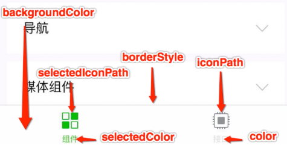
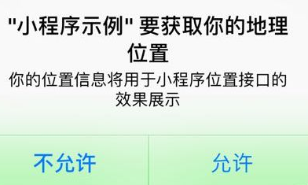

## 页面构成

### JSON 配置

在项目的根目录有一个 `app.json` 和 `project.config.json`，此外在 `pages/logs` 目录下还有一个 `logs.json`

#### 配置 app.json

`app.json` 是当前小程序的全局配置，包括了小程序的所有页面路径、界面表现、网络超时时间、底部 tab 等。

```json
{
  "pages":[
    "pages/index/index",
  ],
  "window":{
    "backgroundTextStyle":"light",
  },
  "tabBar":{},
  "networkTimeout":{} ,                
	"navigateToMiniProgramAppIdList":{},
  "permission":{},
  "usingComponents":{},
}
```

##### pages

用于指定小程序由哪些页面组成，每一项都对应一个页面的 路径（含文件名） 信息。文件名不需要写文件后缀，框架会自动去寻找对于位置的 `.json`, `.js`, `.wxml`, `.wxss` 四个文件进行处理。

```json
{
  "pages": ["pages/index/index", "pages/logs/logs"]
}
```

##### window

用于设置小程序的状态栏、导航条、标题、窗口背景色

```json
{
  "window": {
    "navigationBarBackgroundColor": "#ffffff", //导航栏背景颜色,16进制
    "navigationBarTextStyle": "black", //导航栏标题颜色，仅支持 black / white
    "navigationBarTitleText": "微信接口功能演示", //导航栏标题文字内容
    "navigationStyle":"default", //导航栏样式,default默认样式 custom 自定义导航栏，只保留右上角胶囊按钮。
    "backgroundColor": "#eeeeee", //窗口的背景色
    "backgroundTextStyle": "light", //下拉 loading 的样式，仅支持 dark / light
		"enablePullDownRefresh":false, //是否开启全局的下拉刷新
    "onReachBottomDistance":50,  //页面上拉触底事件触发时距页面底部距离，单位为 px。
  	"pageOrientation":"portrait" //屏幕旋转设置，支持 auto / portrait / landscape
  }
}
```


##### tabBar

通过 tabBar 配置项指定窗口的底部或顶部tab 栏切换页面

```json
{
  "tabBar":{
     "color":"#ffffff", //tab 上的文字默认颜色，仅支持十六进制颜色
     "selectedColor":"#ffffff", //tab 上的文字选中时的颜色，仅支持十六进制颜色
  	 "backgroundColor":"#ffffff", //tab 的背景色，仅支持十六进制颜色
  	 "borderStyle":"black", //tabbar 上边框的颜色， 仅支持 black / white
  	 "position":"bottom",  //tabBar 的位置，仅支持 bottom / top
  	 "custom":false, //自定义 tabBar
  	 "list":[   //tab 的列表,最少 2 个、最多 5 个 tab
				 {
          "pagePath": "pages/src",  //页面路径，必须在 pages 中先定义
					"text":"text",   //tab 上按钮文字                                        
         	"iconPath": "",  //图片路径，icon 大小限制为 40kb，建议尺寸为 81px * 81px
          "selectedIconPath":""  //选中时的图片路径,当 position 为 top 时，不显示 icon。
         },
        {...}
     ]
  }
}
```



##### networkTimeout

各类网络请求的超时时间，单位均为毫秒

```json
{
  "networkTimeout":{
       "request":60000,   //wx.request 的超时时间
  		 "connectSocket":60000,   //wx.connectSocket 的超时时间
  		 "uploadFile":60000,   //wx.uploadFile 的超时时间
  		 "downloadFile":60000   //wx.downloadFile 的超时时间
  }
}
```

##### debug

在开发者工具中开启 `debug` 模式

##### functionalPages

插件所有者小程序需要设置这一项来启用插件功能页

```json
{
  "functionalPages": {
    "independent": true
  }
}
//兼容写法
{
  "functionalPages": true
}
```

`"independent": true` 会使得插件功能页的代码独立于其他代码，这意味着插件功能页可以被独立下载、加载，具有更好的性能表现

##### subpackages

启用分包加载时，声明项目分包结构

```json
{
  "subpackages":[
     {
       "root": "packageA",   //分包根目录  
     	 "name": "packA",  //分包别名，分包预下载时可以使用
       "pages": ["pages/cat","pages/dog"],  //分包页面路径，相对与分包根目录
       "independent": true  //分包是否是独立分包
     },
     {....}
  ]
}
```

###### 打包原则

- 声明 `subpackages` 后，将按 `subpackages` 配置路径进行打包，`subpackages` 配置路径外的目录将被打包到 app（主包） 中
- app（主包）也可以有自己的 pages（即最外层的 pages 字段）
- `subpackage` 的根目录不能是另外一个 `subpackage` 内的子目录
- `tabBar` 页面必须在 app（主包）内

###### 引用原则

- `packageA` 无法 require `packageB` JS 文件，但可以 require `app`、自己 package 内的 JS 文件
- `packageA` 无法 import `packageB` 的 template，但可以 require `app`、自己 package 内的 template
- `packageA` 无法使用 `packageB` 的资源，但可以使用 `app`、自己 package 内的资源

###### 独立分包

从独立分包中页面进入小程序时，不需要下载主包。当用户进入普通分包或主包内页面时，主包才会被下载。

当小程序从普通的分包页面启动时，需要首先下载主包；而独立分包不依赖主包即可运行，可以很大程度上提升分包页面的启动速度

在`subpackages`字段中对应的分包配置项中定义`independent`字段声明对应分包为独立分包

- **独立分包中不能依赖主包和其他分包中的内容**，包括js文件、template、wxss、自定义组件、插件等。主包中的`app.wxss`对独立分包无效，应避免在独立分包页面中使用 `app.wxss` 中的样式；
- `App` 只能在主包内定义，独立分包中不能定义 `App`，会造成无法预期的行为；
- 独立分包中暂时不支持使用插件。

##### workers

使用 Worker处理多线程任务时，设置 `Worker` 代码放置的目录

##### requiredBackgroundModes

申明需要后台运行的能力，类型为数组，目前支持：`audio`: 后台音乐播放，`location`: 后台定位

```json
{
   "requiredBackgroundModes": ["audio", "location"]
}
```

##### plugins

声明小程序需要使用的插件

```json
{
  "plugins": {
    "myPlugin": {
      "version": "1.0.0",
      "provider": "wxidxxxxxxxxxxxxxxxx"
    }
  }
}
```

`plugins` 定义段中可以包含多个插件声明，每个插件声明以一个使用者自定义的插件引用名作为标识，并指明插件的 appid 和需要使用的版本号

##### preloadRule

在进入小程序某个页面时，由框架自动预下载可能需要的分包，提升进入后续分包页面时的启动速度

```json
{
 "preloadRule": {
    "pages/index": {
      "network": "all", //在指定网络下预下载,all: 不限网络,wifi: 仅wifi下预下载
      "packages": ["important"] //进入页面后预下载分包的 root 或 name。__APP__ 表示主包
    },
    "sub1/index": {
      "packages": ["hello", "sub3"]
    }
  }
}
```

`preloadRule` 中，`key` 是页面路径，`value` 是进入此页面的预下载配置

同一个分包中的页面享有共同的预下载大小限额 2M，限额会在工具中打包时校验

##### resizable

在 iPad 上运行的小程序可以设置支持屏幕旋转,在 iPad 上不能单独配置某个页面是否支持屏幕旋转。

```json
{
  "resizable": true
}
```

##### navigateToMiniProgramAppIdList

当小程序需要使用 `wx.navigateToMiniProgram` 接口跳转到其他小程序时，需要先在配置文件中声明需要跳转的小程序 `appId `列表，最多允许填写 10 个

```json
{
   "navigateToMiniProgramAppIdList": [
    "wxe5f52902cf4de896"
  ]
}
```

##### usingComponents

在此处声明的自定义组件视为全局自定义组件，在小程序内的页面或自定义组件中可以直接使用而无需再声明

##### permission

小程序接口权限相关设置

```json
{
"permission": {
    "scope.userLocation": {//地理位置
      "desc": "你的位置信息" //小程序获取权限时展示的接口用途说明。最长 30 个字符
    },
  	"scope.userInfo":{"desc":"...."},  //用户信息
  	"scope.userLocationBackground":{...},  //后台定位
		"scope.address":{...},  //通讯地址
	  "scope.werun":{....}, // 微信运动步数
    "scope.record":{...}, //录音功能              
    "scope.writePhotosAlbum":{..},  //保存到相册
    "scope.camera":{..},  //摄像头
    "scope.invoiceTitle":{...}, //发票抬头
    "scope.invoice":{...}  //获取发票
  }
}
```



##### sitemapLocation

指明 `sitemap.json `的位置；默认为 'sitemap.json' 即在 app.json 同级目录下名字的 `sitemap.json` 文件

### 工具配置 

在项目根目录使用 `project.config.json` 文件对项目进行[配置](https://developers.weixin.qq.com/miniprogram/dev/devtools/projectconfig.html)

### 页面配置 page.json

每个页面可以使用同名 `.json` 文件来对本页面的窗口表现进行配置，页面中配置项会覆盖 `app.json` 的 `window` 中相同的配置项。

```json
{
  "navigationBarBackgroundColor": "#ffffff",
  "navigationBarTextStyle": "black",
  "navigationBarTitleText": "微信接口功能演示",
  "backgroundColor": "#eeeeee",
  "backgroundTextStyle": "light"
}
```

### WXML

是框架设计的一套标签语言，结合基础组件、事件系统，可以构建出页面的结构，

#### 数据绑定

##### 简单绑定

数据绑定使用 Mustache 语法（双大括号）将变量包起来

```jsx
<!--wxml-->
<view> {{message}} </view>
// page.js
Page({
  data: {
    message: 'Hello MINA!'
  }
})
```

##### 组件属性(需要在双引号之内)

```jsx
<view id="item-{{id}}"> </view>
Page({
  data: {
    id: 0
  }
})
```

##### 关键字(需要在双引号之内)

```jsx
<checkbox checked="{{false}}"> </checkbox>
```

##### 运算

可以在 `{{}}` 内进行简单的运算

```jsx
<view hidden="{{flag ? true : false}}"> Hidden </view>  //三元运算
<view>{{"hello" + name}}</view>   //字符串拼接
<view wx:if="{{length > 5}}"> </view>   //比较运算
<view> {{a + b}} + {{c}} + d </view>  //算数运算
<view>{{object.key}} {{array[0]}}</view>  //数据路径运算
Page({
  data: {
    a: 1,
    b: 2,
    c: 3,
    name: 'dd',
    object:{key:'cc'},
    array: ['aa']
  }
})
```

##### 组合

可以在 Mustache 内直接进行组合，构成新的对象或者数组,也可以用扩展运算符 `...` 来将一个对象展开,

如果对象的 key 和 value 相同，也可以间接地表达,如有存在变量名相同的情况，后边的会覆盖前面

```jsx
<view wx:for="{{[zero, 1, 2, 3, 4]}}"> {{item}} </view>  //[0, 1, 2, 3, 4]
<template is="objectCombine" data="{{for: a, bar: b}}"></template> //{for: 1, bar: 2}
<template is="objectCombine" data="{{...obj1, ...obj2, e: 5}}"></template>
<template is="objectCombine" data="{{foo, bar}}"></template>//{foo:'my-foo',bar:'my-bar'}
Page({
  data: {
    zero: 0,
    a:1,
  	b:2,
    obj1:{},
    obj2:{}
    foo:'',
    bar: ''
  }
})
```

#### 列表渲染

在组件上使用 `wx:for` 控制属性绑定一个数组，即可使用数组中各项的数据重复渲染该组件,默认数组的当前项的下标变量名默认为 `index`，数组当前项的变量名默认为 `item`

```jsx
<!--wxml-->
<view wx:for="{{array}}">
  {{index}}: {{item}}
</view>
// page.js
Page({
  data: {
    array: [1, 2, 3, 4, 5]
  }
})
```

使用 `wx:for-item` 可以指定数组当前元素的变量名，使用 `wx:for-index` 可以指定数组当前下标的变量名,使用 `wx:key` 来指定列表中项目的唯一的标识符,**如不提供 wx:key，会报一个 warning， 如果明确知道该列表是静态，或者不必关注其顺序，可以选择忽略**

`wx:key` 的值以两种形式提供: 字符串,关键字 `*this` 代表在 for 循环中的 item 本身

```jsx
<view wx:for="{{array}}" wx:for-index="idx" wx:for-item="itemName" wx:key="itemName">
  {{idx}}: {{itemName.message}}
</view>
<view wx:for="{{array}}" wx:for-index="idx" wx:for-item="itemName" wx:key="*this">
  {{idx}}: {{itemName.message}}
</view>
```

当 `wx:for` 的值为字符串时，会将字符串解析成字符串数组

```jsx
<view wx:for="array">
  {{item}}
</view>
//等同于
<view wx:for="{{['a','r','r','a','y']}}">
  {{item}}
</view>
```


#### 条件渲染

```jsx
<!--wxml-->
<view wx:if="{{view == 'WEBVIEW'}}"> WEBVIEW </view>
<view wx:elif="{{view == 'APP'}}"> APP </view>
<view wx:else="{{view == 'MINA'}}"> MINA </view>
// page.js
Page({
  data: {
    view: 'MINA'
  }
})
```

`wx:if` 有更高的切换消耗而 `hidden` 有更高的初始渲染消耗

#### 模板

在模板中定义代码片段，然后在不同的地方调用，

使用 name 属性，作为模板的名字。然后在`<template/>`内定义代码片段

使用 is 属性，声明需要的使用的模板，可以使用 Mustache 语法，来动态决定具体需要渲染哪个模板，然后将模板所需要的 data 传入

```jsx
<!--wxml-->
<template name="staffName">
  <view>
    FirstName: {{firstName}}, LastName: {{lastName}}
  </view>
</template>
<template is="staffName" data="{{...staffA}}"></template>
<template is="staffName" data="{{...staffB}}"></template>
<template is="staffName" data="{{...staffC}}"></template>

// page.js
Page({
  data: {
    staffA: {firstName: 'Hulk', lastName: 'Hu'},
    staffB: {firstName: 'Shang', lastName: 'You'},
    staffC: {firstName: 'Gideon', lastName: 'Lin'}
  }
})
```

模板拥有自己的作用域，只能使用 data 传入的数据以及模板定义文件中定义的 `<wxs />` 模块

### WXSS 样式

`WXSS` 具有 `CSS` 大部分的特性，也做了一些扩充和修改。

新增了尺寸单位，提供了全局的样式和局部样式，`WXSS` 仅支持部分 `CSS` 选择器

#### 尺寸单位

`rpx（responsive pixel）`: 可以根据屏幕宽度进行自适应。规定屏幕宽为`750rpx`。

在 iPhone6 上，屏幕宽度为375px，共有750个物理像素，则750rpx = 375px = 750物理像素，1rpx = 0.5px = 1物理像素

#### 样式导入

使用`@import`语句可以导入外联样式表，`@import`后跟需要导入的外联样式表的相对路径，用`;`表示语句结束。

```css
@import "common.wxss";
```

##### 内联样式

框架组件上支持使用 style、class 属性来控制组件的样式

`style` 接收动态的样式，在运行时会进行解析，请尽量避免将静态的样式写进 style 中，以免影响渲染速度

```jsx
<view style="color:{{color}};" />
```

`class`用于指定样式规则,静态的样式统一写到 class 中,其属性值是样式规则中类选择器名(样式类名)的集合，样式类名不需要带上`.`，样式类名之间用空格分隔。

```jsx
<view class="normal_view" />
```

##### 选择器

支持的选择器有：

类选择器 `.class`,id选择器 `#id`,组件名选择器`view`,多个组件名选择器 `view,view`,伪元素`::before ::after`

##### 全局样式与局部样式

在 `app.wxss` 中的样式为全局样式，作用于每一个页面

在 page 的 `wxss` 文件中定义的样式为局部样式，只作用在对应的页面，并会覆盖 `app.wxss `中相同的选择器

### js逻辑交互

#### 事件绑定

事件绑定的写法同组件的属性，以 key、value 的形式。

key 以`bind`或`catch`开头，然后跟上事件的类型，在非原生组件中，`bind`和`catch`后可以紧跟一个冒号

value 是一个字符串，需要在对应的 Page 中定义同名的函数

```jsx
<view id="outer" bindtap="handleTap1">
  outer view
  <view id="middle" catchtap="handleTap2">
    middle view
    <view id="inner" bind:tap="handleTap3">
      inner view
    </view>
  </view>
</view>
```

##### 事件冒泡

`bind`事件绑定不会阻止冒泡事件向上冒泡，`catch`事件绑定可以阻止冒泡事件向上冒泡

##### 事件捕获

捕获阶段位于冒泡阶段之前，且在捕获阶段中，事件到达节点的顺序与冒泡阶段恰好相反

`capture-bind`事件绑定监听捕获阶段，`capture-catch`事件绑定将中断捕获阶段和取消冒泡阶段

```jsx
<view id="outer" bind:touchstart="handleTap1" capture-bind:touchstart="handleTap2">
  outer view
  <view id="inner" bind:touchstart="handleTap3" capture-bind:touchstart="handleTap4">
    inner view
  </view>
</view>
```

#### 事件对象

无特殊说明，当组件触发事件时，逻辑层绑定该事件的处理函数会收到一个事件对象

##### 基础事件对象属性

`type`: 事件类型，字符串类型

`timeStamp`: 事件生成时的时间戳，数字类型

`target`: 触发事件的组件的一些属性值集合，包含事件源组件的id和dataset（事件源组件上由`data-`开头的自定义属性组成的集合）

`currentTarget`:当前组件的一些属性值集合，包含当前组件的id和dataset（当前组件上由`data-`开头的自定义属性组成的集合）

`mark`: 事件标记数据,可以使用 `mark` 来识别具体触发事件的 target 节点,类似vue中的ref

```jsx
{
  type: '',
  timeStamp:895,
  target:{
    id: '',
  	dataset:{}
  },
	currentTarget:{
    id: 'tapTest',
  	dataset:{
      "hi":"WeChat"
    }                      
  }
}
<view mark:myMark="last" bindtap="bindViewTap">
  <button mark:anotherMark="leaf" bindtap="bindButtonTap">按钮</button>
</view>
```

##### 自定义事件对象属性

在基础事件对象属性上增加了`detail`属性(Object类型)，表示自定义事件所携带的数据

如表单组件的提交事件会携带用户的输入，媒体的错误事件会携带错误信息

点击事件的`detail` 带有的 x, y 同 pageX, pageY 代表距离文档左上角的距离

##### 触摸事件对象属性

在基础事件对象属性上增加了`touches`属性（一个数组）和`changedTouches`属性（一个数组）

`touches`：当前停留在屏幕中的触摸点信息的数组

`changedTouches`：当前变化的触摸点信息的数组

```jsx
{
  "touches":[{
    "identifier":0,  //触摸点的标识符
    "pageX":53, //距离文档左上角的距离，文档的左上角为原点 ,横向为X轴，纵向为Y轴
    "pageY":14,
    "clientX":53, //距离页面可显示区域（屏幕除去导航条）左上角距离,横向为X轴，纵向为Y轴
    "clientY":14
  }],
  "changedTouches":[{
    "identifier":0,
    "pageX":53,
    "pageY":14,
    "clientX":53,
    "clientY":14
  }]
}

```

 **canvas 中的触摸事件不可冒泡**,所以没有 currentTarget

```jsx
{
  "CanvasTouch":{
      "identifier":0, //触摸点的标识符	
      "x":23, //距离 Canvas 左上角的距离，Canvas 的左上角为原点 ，横向为X轴，纵向为Y轴
      "y":23
  } 
}
```

#### 事件分类

事件分为冒泡事件和非冒泡事件，

冒泡事件：当一个组件上的事件被触发后，该事件会向父节点传递

冒泡事件：当一个组件上的事件被触发后，该事件不会向父节点传递

| 冒泡事件类型       | 触发条件                                                  |
| ------------------ | --------------------------------------------------------- |
| touchstart         | 手指触摸动作开始                                          |
| touchmove          | 手指触摸后移动                                            |
| touchcancel        | 手指触摸动作被打断，如来电提醒，弹窗                      |
| touchend           | 手指触摸动作结束                                          |
| tap                | 手指触摸后马上离开                                        |
| longpress          | 手指触摸后，超过350ms再离开                               |
| longtap            | 手指触摸后，超过350ms再离开                               |
| transitionend      | 会在 WXSS transition 或 wx.createAnimation 动画结束后触发 |
| animationstart     | 会在一个 WXSS animation 动画开始时触发                    |
| animationiteration | 会在一个 WXSS animation 一次迭代结束时触发                |
| animationend       | 会在一个 WXSS animation 动画完成时触发                    |
| touchforcechange   | 在支持 3D Touch 的 iPhone 设备，重按时会触发              |

**除上表之外的其他组件自定义事件如无特殊声明都是非冒泡事件**

#### 使用WXS函数响应事件

WXS函数接受2个参数，第一个是event事件对象,第二个参数是`ownerInstance`,表示触发事件的组件所在的组件的 `ComponentDescriptor` 实例

- 在组件中绑定和注册事件处理的WXS函数

```jsx
<wxs module="wxs" src="./test.wxs"></wxs>
<view id="tapTest" data-hi="WeChat" bindtap="{{wxs.tapName}}"> Click me! </view>
//绑定的WXS函数必须用{{}}括起来
//test.wxs
function tapName(event, ownerInstance) {
  console.log('tap wechat', JSON.stringify(event))
}
module.exports = {
  tapName: tapName
}
```

WXS 函数的除了纯逻辑的运算，还可以通过封装好的`ComponentDescriptor` 实例来访问以及设置组件的 class 和样式

```jsx
var wxsFunction = function(event, ownerInstance) {
    var instance = ownerInstance.selectComponent('.classSelector') // 返回组件的实例
    instance.setStyle({
        "font-size": "14px" // 支持rpx
    })
    instance.getDataset()
    instance.setClass(className)
    // ...
    return false // 不往上冒泡，相当于调用了同时调用了stopPropagation和preventDefault
}
```

`ComponentDescriptor` 实例方法

| 方法                           | 参数                           | 描述                             |
| ------------------------------ | ------------------------------ | -------------------------------- |
| selectComponent                | selector对象                   | 返回组件的 实例                  |
| selectAllComponents            | selector对象数组               | 返回组件的 实例数组              |
| setStyle                       | Object/string                  | 设置组件样式，支持`rpx`          |
| addClass/removeClass/ hasClass | string                         | 设置组件的 class                 |
| getDataset                     | 无                             | 返回当前组件/页面的 dataset 对象 |
| callMethod                     | (funcName:string, args:object) | 调用当前组件/页面定义的函数      |
| requestAnimationFrame          | Function                       | 与原生js一样，用于设置动画       |
| getState                       | 无                             | 存储局部变量后续使用，饭一个对象 |
| triggerEvent                   | (eventName, detail)            | 和组件的triggerEvent一致         |

