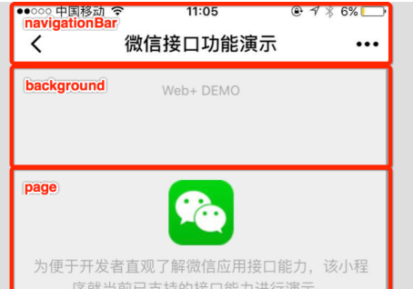
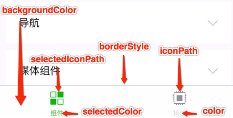
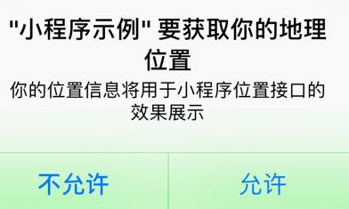

<!--
 * @Description: In User Settings Edit
 * @Author: your name
 * @Date: 2019-10-11 14:58:27
 * @LastEditTime: 2019-10-12 11:40:34
 * @LastEditors: Please set LastEditors
 -->


## JSON 配置

在项目的根目录有一个 `app.json` 和 `project.config.json`，此外在 `pages/logs` 目录下还有一个 `logs.json`

### 配置 app.json

`app.json` 是当前小程序的全局配置，包括了小程序的所有页面路径、界面表现、网络超时时间、底部 tab 等。

```json
{
  "pages":[
    "pages/index/index",
  ],
  "window":{
    "backgroundTextStyle":"light",
  },
  "tabBar":{},
  "networkTimeout":{} ,                
	"navigateToMiniProgramAppIdList":{},
  "permission":{},
  "usingComponents":{},
  
}
```

#### pages

用于指定小程序由哪些页面组成，每一项都对应一个页面的 路径（含文件名） 信息。文件名不需要写文件后缀，框架会自动去寻找对于位置的 `.json`, `.js`, `.wxml`, `.wxss` 四个文件进行处理。

```json
{
  "pages": ["pages/index/index", "pages/logs/logs"]
}
```

#### window

用于设置小程序的状态栏、导航条、标题、窗口背景色

```json
{
  "window": {
    "navigationBarBackgroundColor": "#ffffff", //导航栏背景颜色,16进制
    "navigationBarTextStyle": "black", //导航栏标题颜色，仅支持 black / white
    "navigationBarTitleText": "微信接口功能演示", //导航栏标题文字内容
    "navigationStyle":"default", //导航栏样式,default默认样式 custom 自定义导航栏，只保留右上角胶囊按钮。
    "backgroundColor": "#eeeeee", //窗口的背景色
    "backgroundTextStyle": "light", //下拉 loading 的样式，仅支持 dark / light
		"enablePullDownRefresh":false, //是否开启全局的下拉刷新
    "onReachBottomDistance":50,  //页面上拉触底事件触发时距页面底部距离，单位为 px。
  	"pageOrientation":"portrait" //屏幕旋转设置，支持 auto / portrait / landscape
  }
}
```



#### tabBar

通过 tabBar 配置项指定窗口的底部或顶部tab 栏切换页面

```json
{
  "tabBar":{
     "color":"#ffffff", //tab 上的文字默认颜色，仅支持十六进制颜色
     "selectedColor":"#ffffff", //tab 上的文字选中时的颜色，仅支持十六进制颜色
  	 "backgroundColor":"#ffffff", //tab 的背景色，仅支持十六进制颜色
  	 "borderStyle":"black", //tabbar 上边框的颜色， 仅支持 black / white
  	 "position":"bottom",  //tabBar 的位置，仅支持 bottom / top
  	 "custom":false, //自定义 tabBar
  	 "list":[   //tab 的列表,最少 2 个、最多 5 个 tab
				 {
          "pagePath": "pages/src",  //页面路径，必须在 pages 中先定义
					"text":"text",   //tab 上按钮文字                                        
         	"iconPath": "",  //图片路径，icon 大小限制为 40kb，建议尺寸为 81px * 81px
          "selectedIconPath":""  //选中时的图片路径,当 position 为 top 时，不显示 icon。
         },
        {...}
     ]
  }
}
```



#### networkTimeout

各类网络请求的超时时间，单位均为毫秒

```json
{
  "networkTimeout":{
       "request":60000,   //wx.request 的超时时间
  		 "connectSocket":60000,   //wx.connectSocket 的超时时间
  		 "uploadFile":60000,   //wx.uploadFile 的超时时间
  		 "downloadFile":60000   //wx.downloadFile 的超时时间
  }
}
```

#### debug

在开发者工具中开启 `debug` 模式

#### functionalPages

插件所有者小程序需要设置这一项来启用插件功能页

```json
{
  "functionalPages": {
    "independent": true,
  }
}
//兼容写法
{
  "functionalPages": true
}
```

`"independent": true` 会使得插件功能页的代码独立于其他代码，这意味着插件功能页可以被独立下载、加载，具有更好的性能表现

#### subpackages

启用分包加载时，声明项目分包结构

```json
{
  "subpackages":[
     {
       "root": "packageA",   //分包根目录  
     	 "name": "packA",  //分包别名，分包预下载时可以使用
       "pages": ["pages/cat","pages/dog"],  //分包页面路径，相对与分包根目录
       "independent": true  //分包是否是独立分包
     },
     {....}
  ]
}
```

##### 打包原则

- 声明 `subpackages` 后，将按 `subpackages` 配置路径进行打包，`subpackages` 配置路径外的目录将被打包到 app（主包） 中
- app（主包）也可以有自己的 pages（即最外层的 pages 字段）
- `subpackage` 的根目录不能是另外一个 `subpackage` 内的子目录
- `tabBar` 页面必须在 app（主包）内

##### 引用原则

- `packageA` 无法 require `packageB` JS 文件，但可以 require `app`、自己 package 内的 JS 文件
- `packageA` 无法 import `packageB` 的 template，但可以 require `app`、自己 package 内的 template
- `packageA` 无法使用 `packageB` 的资源，但可以使用 `app`、自己 package 内的资源

##### 独立分包

从独立分包中页面进入小程序时，不需要下载主包。当用户进入普通分包或主包内页面时，主包才会被下载。

当小程序从普通的分包页面启动时，需要首先下载主包；而独立分包不依赖主包即可运行，可以很大程度上提升分包页面的启动速度

在`subpackages`字段中对应的分包配置项中定义`independent`字段声明对应分包为独立分包

- **独立分包中不能依赖主包和其他分包中的内容**，包括js文件、template、wxss、自定义组件、插件等。主包中的`app.wxss`对独立分包无效，应避免在独立分包页面中使用 `app.wxss` 中的样式；
- `App` 只能在主包内定义，独立分包中不能定义 `App`，会造成无法预期的行为；
- 独立分包中暂时不支持使用插件。

#### workers

使用 Worker处理多线程任务时，设置 `Worker` 代码放置的目录

#### requiredBackgroundModes

申明需要后台运行的能力，类型为数组，目前支持：`audio`: 后台音乐播放，`location`: 后台定位

```json
{
   "requiredBackgroundModes": ["audio", "location"]
}
```

#### plugins

声明小程序需要使用的插件

```json
{
  "plugins": {
    "myPlugin": {
      "version": "1.0.0",
      "provider": "wxidxxxxxxxxxxxxxxxx",
    }
  }
}
```

`plugins` 定义段中可以包含多个插件声明，每个插件声明以一个使用者自定义的插件引用名作为标识，并指明插件的 appid 和需要使用的版本号

#### preloadRule

在进入小程序某个页面时，由框架自动预下载可能需要的分包，提升进入后续分包页面时的启动速度

```json
{
 "preloadRule": {
    "pages/index": {
      "network": "all", //在指定网络下预下载,all: 不限网络,wifi: 仅wifi下预下载
      "packages": ["important"] //进入页面后预下载分包的 root 或 name。__APP__ 表示主包
    },
    "sub1/index": {
      "packages": ["hello", "sub3"],
      "network": "all"
    }
  }
}
```

`preloadRule` 中，`key` 是页面路径，`value` 是进入此页面的预下载配置

同一个分包中的页面享有共同的预下载大小限额 2M，限额会在工具中打包时校验

#### resizable

在 iPad 上运行的小程序可以设置支持屏幕旋转,在 iPad 上不能单独配置某个页面是否支持屏幕旋转。

```json
{
  "resizable": true
}
```

#### navigateToMiniProgramAppIdList

当小程序需要使用 `wx.navigateToMiniProgram` 接口跳转到其他小程序时，需要先在配置文件中声明需要跳转的小程序 `appId `列表，最多允许填写 10 个

```json
{
   "navigateToMiniProgramAppIdList": [
    "wxe5f52902cf4de896"
  ]
}
```

#### usingComponents

在此处声明的自定义组件视为全局自定义组件，在小程序内的页面或自定义组件中可以直接使用而无需再声明

#### permission

小程序接口权限相关设置

```json
{
"permission": {
    "scope.userLocation": {//地理位置
      "desc": "你的位置信息" //小程序获取权限时展示的接口用途说明。最长 30 个字符
    },
  	"scope.userInfo":{"desc":"...."},  //用户信息
  	"scope.userLocationBackground":{...},  //后台定位
		"scope.address":{...},  //通讯地址
	  "scope.werun":{....}, // 微信运动步数
    "scope.record":{...}, //录音功能              
    "scope.writePhotosAlbum":{..},  //保存到相册
    "scope.camera":{..},  //摄像头
    "scope.invoiceTitle":{...}, //发票抬头
    "scope.invoice":{...}  //获取发票
  }
}
```



#### sitemapLocation

指明 `sitemap.json `的位置；默认为 'sitemap.json' 即在 app.json 同级目录下名字的 `sitemap.json` 文件

### 工具配置 

在项目根目录使用 `project.config.json` 文件对项目进行[配置](https://developers.weixin.qq.com/miniprogram/dev/devtools/projectconfig.html)

### 页面配置 page.json

每个页面可以使用同名 `.json` 文件来对本页面的窗口表现进行配置，页面中配置项会覆盖 `app.json` 的 `window` 中相同的配置项。

```json
{
  "navigationBarBackgroundColor": "#ffffff",
  "navigationBarTextStyle": "black",
  "navigationBarTitleText": "微信接口功能演示",
  "backgroundColor": "#eeeeee",
  "backgroundTextStyle": "light"
}
```

## WXML

是框架设计的一套标签语言，结合基础组件、事件系统，可以构建出页面的结构，

### 数据绑定

#### 简单绑定

数据绑定使用 Mustache 语法（双大括号）将变量包起来

```jsx
<!--wxml-->
<view> {{message}} </view>
// page.js
Page({
  data: {
    message: 'Hello MINA!'
  }
})
```

#### 组件属性(需要在双引号之内)

```jsx
<view id="item-{{id}}"> </view>
Page({
  data: {
    id: 0
  }
})
```

#### 关键字(需要在双引号之内)

```jsx
<checkbox checked="{{false}}"> </checkbox>
```

#### 运算

可以在 `{{}}` 内进行简单的运算

```jsx
<view hidden="{{flag ? true : false}}"> Hidden </view>  //三元运算
<view>{{"hello" + name}}</view>   //字符串拼接
<view wx:if="{{length > 5}}"> </view>   //比较运算
<view> {{a + b}} + {{c}} + d </view>  //算数运算
<view>{{object.key}} {{array[0]}}</view>  //数据路径运算
Page({
  data: {
    a: 1,
    b: 2,
    c: 3,
    name: 'dd',
    object:{key:'cc'},
    array: ['aa']
  }
})
```

#### 组合

可以在 Mustache 内直接进行组合，构成新的对象或者数组,也可以用扩展运算符 `...` 来将一个对象展开,

如果对象的 key 和 value 相同，也可以间接地表达,如有存在变量名相同的情况，后边的会覆盖前面

```jsx
<view wx:for="{{[zero, 1, 2, 3, 4]}}"> {{item}} </view>  //[0, 1, 2, 3, 4]
<template is="objectCombine" data="{{for: a, bar: b}}"></template> //{for: 1, bar: 2}
<template is="objectCombine" data="{{...obj1, ...obj2, e: 5}}"></template>
<template is="objectCombine" data="{{foo, bar}}"></template>//{foo:'my-foo',bar:'my-bar'}
Page({
  data: {
    zero: 0,
    a:1,
  	b:2,
    obj1:{},
    obj2:{}
    foo:'',
    bar: ''
  }
})
```

### 列表渲染

在组件上使用 `wx:for` 控制属性绑定一个数组，即可使用数组中各项的数据重复渲染该组件,默认数组的当前项的下标变量名默认为 `index`，数组当前项的变量名默认为 `item`

```jsx
<!--wxml-->
<view wx:for="{{array}}">
  {{index}}: {{item}}
</view>
// page.js
Page({
  data: {
    array: [1, 2, 3, 4, 5]
  }
})
```

使用 `wx:for-item` 可以指定数组当前元素的变量名，使用 `wx:for-index` 可以指定数组当前下标的变量名,使用 `wx:key` 来指定列表中项目的唯一的标识符,**如不提供 wx:key，会报一个 warning， 如果明确知道该列表是静态，或者不必关注其顺序，可以选择忽略**

`wx:key` 的值以两种形式提供: 字符串,关键字 `*this` 代表在 for 循环中的 item 本身

```jsx
<view wx:for="{{array}}" wx:for-index="idx" wx:for-item="itemName" wx:key="itemName">
  {{idx}}: {{itemName.message}}
</view>
<view wx:for="{{array}}" wx:for-index="idx" wx:for-item="itemName" wx:key="*this">
  {{idx}}: {{itemName.message}}
</view>
```

当 `wx:for` 的值为字符串时，会将字符串解析成字符串数组

```jsx
<view wx:for="array">
  {{item}}
</view>
//等同于
<view wx:for="{{['a','r','r','a','y']}}">
  {{item}}
</view>
```


### 条件渲染

```jsx
<!--wxml-->
<view wx:if="{{view == 'WEBVIEW'}}"> WEBVIEW </view>
<view wx:elif="{{view == 'APP'}}"> APP </view>
<view wx:else="{{view == 'MINA'}}"> MINA </view>
// page.js
Page({
  data: {
    view: 'MINA'
  }
})
```

`wx:if` 有更高的切换消耗而 `hidden` 有更高的初始渲染消耗

### 模板

在模板中定义代码片段，然后在不同的地方调用，

使用 name 属性，作为模板的名字。然后在`<template/>`内定义代码片段

使用 is 属性，声明需要的使用的模板，可以使用 Mustache 语法，来动态决定具体需要渲染哪个模板，然后将模板所需要的 data 传入

```jsx
<!--wxml-->
<template name="staffName">
  <view>
    FirstName: {{firstName}}, LastName: {{lastName}}
  </view>
</template>
<template is="staffName" data="{{...staffA}}"></template>
<template is="staffName" data="{{...staffB}}"></template>
<template is="staffName" data="{{...staffC}}"></template>

// page.js
Page({
  data: {
    staffA: {firstName: 'Hulk', lastName: 'Hu'},
    staffB: {firstName: 'Shang', lastName: 'You'},
    staffC: {firstName: 'Gideon', lastName: 'Lin'}
  }
})
```

模板拥有自己的作用域，只能使用 data 传入的数据以及模板定义文件中定义的 `<wxs />` 模块

### 引用

 两种文件引用方式import和include 

#### import

 import 可以在该文件中使用目标文件定义的 `<template>`,  import 不具有递归的特性 , 不会 import 目标文件中 import 的 template 

```jsx
<!-- item.wxml -->
<template name="item">
  <text>{{text}}</text>
</template>
<!-- index.wxml -->
<import src="item.wxml"/>
<template is="item" data="{{text: 'forbar'}}"/>
```

#### include

 include 可以将目标文件中除了 `<template/>  <wxs/> ` 外的整个代码引入，相当于是拷贝到 include 位置 

```jsx
<!-- index.wxml -->
<include src="header.wxml"/>
<view> body </view>
<include src="footer.wxml"/>
<!-- footer.wxml -->
<view> footer </view>
<!-- header.wxml -->
<view> header </view>
```

### 标签共同属性

 所有wxml 标签都支持的属性称之为共同属性 ：id，class， style ， hidden ， `data-*` (自定义属性)， `bind*/catch* `（事件绑定）

## WXSS 样式

`WXSS` 具有 `CSS` 大部分的特性，也做了一些扩充和修改。

新增了尺寸单位，提供了全局的样式和局部样式，`WXSS` 仅支持部分 `CSS` 选择器

### 尺寸单位

`rpx（responsive pixel）`: 可以根据屏幕宽度进行自适应。规定屏幕宽为`750rpx`。 小程序编译后，rpx会做一次px换算 

在 iPhone6 上，屏幕宽度为375px，共有750个物理像素，则750rpx = 375px = 750物理像素，1rpx = 0.5px = 1物理像素

### 样式引入

使用`@import`语句可以引入外联样式表，`@import`后跟需要导入的外联样式表的相对路径，用`;`表示语句结束。

```css
@import "common.wxss";
```

#### 内联样式

框架组件上支持使用 style、class 属性来控制组件的样式

`style` 接收动态的样式，在运行时会进行解析，请尽量避免将静态的样式写进 style 中，以免影响渲染速度

```jsx
<view style="color:{{color}};" />
```

`class`用于指定样式规则,静态的样式统一写到 class 中,其属性值是样式规则中类选择器名(样式类名)的集合，样式类名不需要带上`.`，样式类名之间用空格分隔。

```jsx
<view class="normal_view" />
```

#### 选择器

支持的选择器有：

类选择器 `.class`,id选择器 `#id`,组件名选择器`view`,多个组件名选择器 `view,view`,伪元素`::before ::after`

#### 全局样式与局部样式

在 `app.wxss` 中的样式为全局样式，作用于每一个页面

在 page 的 `wxss` 文件中定义的样式为局部样式，只作用在对应的页面，并会覆盖 `app.wxss `中相同的选择器

## js逻辑交互

### 事件绑定

事件绑定的写法同组件的属性，以 key、value 的形式。

key 以`bind`或`catch`开头，然后跟上事件的类型，在非原生组件中，`bind`和`catch`后可以紧跟一个冒号

value 是一个字符串，需要在对应的 Page 中定义同名的函数

```jsx
<view id="outer" bindtap="handleTap1">
  outer view
  <view id="middle" catchtap="handleTap2">
    middle view
    <view id="inner" bind:tap="handleTap3">
      inner view
    </view>
  </view>
</view>
```

#### 事件冒泡

`bind`事件绑定不会阻止冒泡事件向上冒泡，`catch`事件绑定可以阻止冒泡事件向上冒泡

#### 事件捕获

捕获阶段位于冒泡阶段之前，且在捕获阶段中，事件到达节点的顺序与冒泡阶段恰好相反

`capture-bind`事件绑定监听捕获阶段，`capture-catch`事件绑定将中断捕获阶段和取消冒泡阶段

```jsx
<view id="outer" bind:touchstart="handleTap1" capture-bind:touchstart="handleTap2">
  outer view
  <view id="inner" bind:touchstart="handleTap3" capture-bind:touchstart="handleTap4">
    inner view
  </view>
</view>
```

### 事件对象

无特殊说明，当组件触发事件时，逻辑层绑定该事件的处理函数会收到一个事件对象

#### 基础事件对象属性

`type`: 事件类型，字符串类型

`timeStamp`: 事件生成时的时间戳，数字类型

`target`: 触发事件的组件的一些属性值集合，包含事件源组件的id和dataset（事件源组件上由`data-`开头的自定义属性组成的集合）

`currentTarget`:当前组件的一些属性值集合，包含当前组件的id和dataset（当前组件上由`data-`开头的自定义属性组成的集合）

`mark`: 事件标记数据,可以使用 `mark` 来识别具体触发事件的 target 节点,类似vue中的ref

```jsx
{
  type: '',
  timeStamp:895,
  target:{
    id: '',
  	dataset:{}
  },
	currentTarget:{
    id: 'tapTest',
  	dataset:{
      "hi":"WeChat"
    }                      
  }
}
<view mark:myMark="last" bindtap="bindViewTap">
  <button mark:anotherMark="leaf" bindtap="bindButtonTap">按钮</button>
</view>
```

#### 自定义事件对象属性

在基础事件对象属性上增加了`detail`属性(Object类型)，表示自定义事件所携带的数据

如表单组件的提交事件会携带用户的输入，媒体的错误事件会携带错误信息

点击事件的`detail` 带有的 x, y 同 pageX, pageY 代表距离文档左上角的距离

#### 触摸事件对象属性

在基础事件对象属性上增加了`touches`属性（一个数组）和`changedTouches`属性（一个数组）

`touches`：当前停留在屏幕中的触摸点信息的数组

`changedTouches`：当前变化的触摸点信息的数组

```jsx
{
  "touches":[{
    "identifier":0,  //触摸点的标识符
    "pageX":53, //距离文档左上角的距离，文档的左上角为原点 ,横向为X轴，纵向为Y轴
    "pageY":14,
    "clientX":53, //距离页面可显示区域（屏幕除去导航条）左上角距离,横向为X轴，纵向为Y轴
    "clientY":14
  }],
  "changedTouches":[{
    "identifier":0,
    "pageX":53,
    "pageY":14,
    "clientX":53,
    "clientY":14
  }]
}

```

 **canvas 中的触摸事件不可冒泡**,所以没有 currentTarget

```jsx
{
  "CanvasTouch":{
      "identifier":0, //触摸点的标识符	
      "x":23, //距离 Canvas 左上角的距离，Canvas 的左上角为原点 ，横向为X轴，纵向为Y轴
      "y":23
  } 
}
```

### 事件分类

事件分为冒泡事件和非冒泡事件，

冒泡事件：当一个组件上的事件被触发后，该事件会向父节点传递

冒泡事件：当一个组件上的事件被触发后，该事件不会向父节点传递

| 冒泡事件类型       | 触发条件                                                  |
| ------------------ | --------------------------------------------------------- |
| touchstart         | 手指触摸动作开始                                          |
| touchmove          | 手指触摸后移动                                            |
| touchcancel        | 手指触摸动作被打断，如来电提醒，弹窗                      |
| touchend           | 手指触摸动作结束                                          |
| tap                | 手指触摸后马上离开                                        |
| longpress          | 手指触摸后，超过350ms再离开                               |
| longtap            | 手指触摸后，超过350ms再离开                               |
| transitionend      | 会在 WXSS transition 或 wx.createAnimation 动画结束后触发 |
| animationstart     | 会在一个 WXSS animation 动画开始时触发                    |
| animationiteration | 会在一个 WXSS animation 一次迭代结束时触发                |
| animationend       | 会在一个 WXSS animation 动画完成时触发                    |
| touchforcechange   | 在支持 3D Touch 的 iPhone 设备，重按时会触发              |

**除上表之外的其他组件自定义事件如无特殊声明都是非冒泡事件**

### wxs

 WXS 代码可以编写在 wxml 文件中的 `<wxs> ` 标签内，或以 `.wxs` 为后缀名的文件内 ,类似于在`html`中使用`<script/>`,

#### 模块

 每一个 `.wxs` 文件和 ` <wxs> ` 标签都是一个单独的模块 ， 一个模块要想对外暴露其内部的私有变量与函数，只能通过 `module.exports` 实现 , 在`.wxs`模块中引用其他 `wxs` 文件模块，可以使用 `require` 函数 .

```jsx
<!--wxml-->
<wxs module="m1">
var msg = "hello world";
module.exports.message = msg;
</wxs>
<view> {{m1.message}} </view>
```

#### `<wxs>` 标签

标签属性：

 `module` : 当前 `<wxs>` 标签的模块名。必填字段 

 `src`:  引用 .wxs 文件的相对路径。仅当本标签为**单闭合标签**或**标签的内容为空**时有效 . 只能引用 `.wxs` 文件模块，且必须使用相对路径 

#### 变量

- WXS 中的变量均为值的引用 
- 没有声明的变量直接赋值使用，会被定义为全局变量 
-  如果只声明变量而不赋值，则默认值为 `undefined` 

#### 数据类型

- `number` ： 数值
- `string` ：字符串
- `boolean`：布尔值
- `object`：对象
- `function`：函数
- `array` : 数组
- `date`：日期
- `regexp`：正则

[参考]( https://developers.weixin.qq.com/miniprogram/dev/reference/wxs/06datatype.html )

#### 基础类库

- console
- Math
- Json
- Number
- Date
- Global

[参考]( https://developers.weixin.qq.com/miniprogram/dev/reference/wxs/07basiclibrary.html )

### 使用WXS函数响应事件

WXS函数接受2个参数，第一个是event事件对象,第二个参数是`ownerInstance`,表示触发事件的组件所在的组件的 `ComponentDescriptor` 实例

- 在组件中绑定和注册事件处理的WXS函数

```jsx
//.wxml
<wxs module="wxs" src="./test.wxs"></wxs>
<view id="tapTest" data-hi="WeChat" bindtap="{{wxs.tapName}}"> Click me! </view>
//绑定的WXS函数必须用{{}}括起来
//test.wxs
function tapName(event, ownerInstance) {
  console.log('tap wechat', JSON.stringify(event))
}
module.exports = {
  tapName: tapName
}
```

WXS 函数的除了纯逻辑的运算，还可以通过封装好的`ComponentDescriptor` 实例来访问以及设置组件的 class 和样式

```jsx
var wxsFunction = function(event, ownerInstance) {
    var instance = ownerInstance.selectComponent('.classSelector') // 返回组件的实例
    instance.setStyle({
        "font-size": "14px" // 支持rpx
    })
    instance.getDataset()
    instance.setClass(className)
    // ...
    return false // 不往上冒泡，相当于调用了同时调用了stopPropagation和preventDefault
}
```

`ComponentDescriptor` 实例方法

| 方法                           | 参数                           | 描述                                       |
| ------------------------------ | ------------------------------ | ------------------------------------------ |
| selectComponent                | selector对象                   | 返回组件的 实例                            |
| selectAllComponents            | selector对象数组               | 返回组件的 实例数组                        |
| setStyle                       | Object/string                  | 设置组件样式，支持`rpx`                    |
| addClass/removeClass/ hasClass | string                         | 设置组件的 class                           |
| getDataset                     | 无                             | 返回当前组件/页面的 dataset 对象           |
| callMethod                     | (funcName:string, args:object) | 调用当前组件/页面定义的函数                |
| requestAnimationFrame          | Function                       | 与原生js一样，用于设置动画                 |
| getState                       | 无                             | 存储局部变量后续使用，饭一个对象           |
| triggerEvent                   | (eventName, detail)            | 和组件的triggerEvent一致，用法类似于emit() |

### 模块化

 小程序中可以将任何一个`JavaScript` 文件作为一个模块，通过`module.exports` 或者 `exports` 对外暴露接口 

```jsx
// moduleA.js
module.exports = function( value ){
  return value * 2;
}
// 在B.js中引用模块A
var multiplyBy2 = require('./moduleA')
var result = multiplyBy2(4)
```

### 作用域

 在文件中声明的变量和函数只在该文件中有效，不同的文件中可以声明相同名字的变量和函数，不会互相影响 。

 当需要使用全局变量的时，通过使用全局函数 `getApp()` 获取全局的实例，并设置相关属性值，来达到设置全局变量的目的 

```jsx
// a.js
// 获取全局变量
var global = getApp()
global.globalValue = 'globalValue'
// b.js
// 访问全局变量
var global = getApp()
console.log(global.globalValue)  // 输出 globalValue
```

 当需要保证全局的数据可以在任何文件中安全的被使用到，那么可以在 `App()` 中进行设置 

```jsx
// app.js
App({
  globalData: 1
})
// a.js
// 获取 global 变量
var app = getApp()
// 修改 global 变量
app.globalData++  // 执行后 globalData 数值为 2
// b.js
// 如果先执行了 a.js 这里的输出应该是 2
console.log(getApp().globalData)
```

## 程序和页面

### 程序构造器App()

 App() 构造器用来注册一个程序 ，必须写在项目根目录的app.js里 。  App构造器接受一个Object参数 。[参考]( https://developers.weixin.qq.com/ebook?action=get_post_info&docid=0004eec99acc808b00861a5bd5280a )

```jsx
App({
  onLaunch: function(options) {},  //当小程序初始化完成时触发
  onShow: function(options) {}, //当小程序启动，或从后台进入前台显示，会触发
  onHide: function() {},  //当小程序从前台进入后台时触发
  onError: function(msg) {},  //当小程序发生脚本错误，或者 API 调用失败时触发
  ...      //可以添加任意的函数或数据到 Object 参数中，在App实例回调用 this 可以访问
})
```

App实例是单例对象，在其他JS脚本中可以使用宿主环境提供的 getApp() 来获取程序实例 

```jsx
// other.js
var appInstance = getApp()
```

### 页面

#### 文件构成和路径

 一个页面是分三部分组成：界面、配置和逻辑。 

 界面由WXML文件和WXSS文件来负责描述，配置由JSON文件进行描述，页面逻辑则是由JS脚本文件负责。 

 页面路径需要在小程序代码根目录app.json中的pages字段声明，否则这个页面不会被注册到宿主环境中。 

#### 页面构造器Page()

 Page() 构造器用来注册一个小程序页面，Page()在页面脚本`.js`中调用 , Page构造器接受一个Object参数 。

 其中data属性是当前页面WXML模板中可以用来做数据绑定的初始数据 。

```jsx
Page({
  data: { text: "This is page data." },  //页面的初始数据
  onLoad: function(options) { },   //生命周期函数--监听页面加载
  onReady: function() { },  //生命周期函数--监听页面初次渲染完成
  onShow: function() { },  //生命周期函数--监听页面显示
  onHide: function() { },  //生命周期函数--监听页面隐藏
  onUnload: function() { },  //生命周期函数--监听页面卸载
  onPullDownRefresh: function() { },  //页面用户行为,监听用户下拉动作
  onReachBottom: function() { },  //页面用户行为,页面上拉触底事件的处理函数
  onShareAppMessage: function () { }, //页面用户行为,定义该函数，右上角菜单才会显示“转发”按钮
  onPageScroll: function() { }//页面用户行为,页面滚动触发事件的处理函数
  ...      //其他,可以添加任意的函数或数据，在Page实例的其他函数中用 this 可以访问
})
```

#### 页面数据

 在Page实例下的方法调用`this.setData()`修改data中的数据 , setData传递数据实际是一个异步的过程 , setData的第二个参数是一个callback回调，在这次setData对界面渲染完毕后触发 

```jsx
// page.js
Page({
  onLoad: function(){
    this.setData({
      text: 'change data'
    }, function(){
      // 在这次setData对界面渲染完毕后触发
    })
  }
})
```

### 页面跳转和路由

| api             | 说明                                                         |
| --------------- | ------------------------------------------------------------ |
| wx.navigateTo   | 保留当前页面，跳转到应用内的某个页面。但是不能跳到 tabbar 页面。 |
| wx.redirectTo   | 页面重定向，关闭当前页面，跳转到应用内的某个页面。但是不允许跳转到 tabbar 页面 |
| wx.navigateBack | 页面返回，关闭当前页面，返回上一页面或多级页面。             |
| wx.switchTab    | 跳转到 tabBar 页面，并关闭其他所有非 tabBar 页面             |
| wx.reLaunch     | 关闭所有页面，打开到应用内的某个页面                         |

`redirectTo`、`switchTab`、`reLaunch`都有4个参数： `url `  `success`  ` fail`  ` complete `

`navigateTo`有5个参数： `url`  ` success`   `fail`   `complete`  ` events `

```jsx
wx.navigateTo({
  url: 'test?id=1',
  events: { //页面间通信接口，用于监听被打开页面发送到当前页面的数据
    // 为指定事件添加一个监听器，获取被打开页面传送到当前页面的数据
    someEvent: function(data) {
      console.log(data)
    }
    ...
  },
  success: function(res) {  //接口调用成功的回调函数
    // 通过eventChannel向被打开页面传送数据
    res.eventChannel.emit('acceptDataFromOpenerPage', { data: 'test' })
  },
  fail(){},   //接口调用失败的回调函数
  complete(){}   //接口调用结束的回调函数（调用成功、失败都会执行）
})
```

`navigateBack`有4个参数： ` delta`  `success`   `fail `  `complete` 

```jsx
wx.navigateBack({
  delta: 2   //默认值1，返回的页面数，如果 delta 大于现有页面数，则返回到首页。
})
```

#### EventChannel

| api  | 参数                            | 说明                                                         |
| ---- | ------------------------------- | ------------------------------------------------------------ |
| emit | (string eventName, any args)    | 触发一个事件                                                 |
| off  | (string eventName, function fn) | 取消监听一个事件。给出第二个参数时，只取消给出的监听函数，否则取消所有监听函数 |
| on   | (string eventName, function fn) | 持续监听一个事件                                             |
| once | (string eventName, function fn) | 监听一个事件一次，触发后失效                                 |

在页面跳转的`success`函数的参数中可以使用EventChannel

```jsx
wx.navigateTo({
  url: 'test?id=1',
  success: function(res) {  //接口调用成功的回调函数
    // 通过eventChannel向被打开页面传送数据
   res.eventChannel.emit('acceptDataFromOpenerPage', { data: 'test' })
})
```

### 页面节点获取

要获取节点，首先需要使用`wx.createSelectorQuery`创建一个 `SelectorQuery` 实例。[参考]( https://developers.weixin.qq.com/miniprogram/dev/api/wxml/NodesRef.context.html )

```jsx
const query = wx.createSelectorQuery()
```

 在自定义组件或包含自定义组件的页面中，应使用 `this.createSelectorQuery()` 来代替 .

#### 实例方法

#####  select(string selector)

  在当前页面下选择第一个匹配选择器 `selector` 的节点。返回一个 `NodesRef` 对象实例，可以用于获取节点信息 

```jsx
query.select(...)
```

 支持下列语法 ：

- ID选择器：#the-id
- class选择器（可以连续指定多个）：.a-class.another-class
- 子元素选择器：.the-parent > .the-child
- 后代选择器：.the-ancestor .the-descendant
- 跨自定义组件的后代选择器：.the-ancestor >>> .the-descendant
- 多选择器的并集：#a-node, .some-other-nodes

##### selectAll(string selector)

 当前页面下选择匹配选择器 selector 的所有节点 

```jsx
query.selectAll(...)
```

##### selectViewport()

 选择显示区域。可用于获取显示区域的尺寸、滚动位置等信息 。无参数

```jsx
query.selectViewport()
```

##### in(Component component)

 将选择器的选取范围更改为自定义组件 `component` 内 

##### exec(function callback)

 执行所有的请求。请求结果按请求次序构成数组，在callback的第一个参数中返回 

#### 节点信息获取方法

在选取节点后执行的操作

##### boundingClientRect(function callback)

 添加节点的布局位置的查询请求。相对于显示区域，以像素为单位 

```jsx
query.select('.img').boundingClientRect(res=>{
  console.log(res)
}).exec()
```

##### context(function callback)

 添加节点的 Context 对象查询请求。 

##### fields(Object fields, function callback)

 获取节点的相关信息。需要获取的字段在fields中指定 

```jsx
wx.createSelectorQuery().select('#the-id').fields({
  id:true, //返回节点 id
  dataset: true, //返回节点 dataset
  size: true, //返回节点尺寸
  rect: true, //返回节点布局位置(left right top bottom）
  scrollOffset: true, //返回节点的 scrollLeft scrollTop，节点必须是 scroll-view或者viewport
  properties: ['scrollX', 'scrollY'], //返回节点对应属性名的当前属性值
  computedStyle: ['margin', 'backgroundColor'], //指定样式名列表，返回节点对应样式名的当前值
  context: true, //返回节点对应的 Context 对象
  node: true, //返回节点对应的 Node 实例
}, function (res) {console.log(res)}).exec()
```

##### node(function callback)

 获取 Node 节点实例。目前支持 Canvas的获取。 

##### scrollOffset(function callback)

 添加节点的滚动位置查询请求。以像素为单位。节点必须是 `scroll-view` 或者 `viewport` 

```jsx
wx.createSelectorQuery().selectViewport().scrollOffset(function(res){}).exec()
```

### 小程序跳转

#### wx.navigateToMiniProgram(Object object)

 打开另一个小程序 ,[参考]( https://developers.weixin.qq.com/miniprogram/dev/api/open-api/miniprogram-navigate/wx.navigateToMiniProgram.html )

```jsx
wx.navigateToMiniProgram({
  appId: '', //要打开的小程序 appId
  path: 'page/index/index?id=123', //打开的页面路径，如果为空则打开首页。
  extraData: {  //需要传递给目标小程序的数据，可在 App.onLaunch，App.onShow中获取到这份数据
    foo: 'bar'
  },
  envVersion: 'develop | trial | release', //要打开的小程序版本。仅在当前小程序为开发版或体验版时此参数有效。
  success(res) { //接口调用成功的回调函数
  },
  fail(){},  //接口调用失败的回调函数
  complete(){}  //接口调用结束的回调函数（调用成功、失败都会执行）
})
```

#### wx.navigateBackMiniProgram(Object object)

 返回到上一个小程序。只有在当前小程序是被其他小程序打开时可以调用成功 

```jsx
wx.navigateBackMiniProgram({
  extraData: {
    foo: 'bar'
  },
  success(res) { //接口调用成功的回调函数
  },
  fail(){},  //接口调用失败的回调函数
  complete(){}  //接口调用结束的回调函数（调用成功、失败都会执行）
})
```

### 网络请求

 每个微信小程序需要事先设置通讯域名，小程序**只可以跟指定的域名与进行网络通信**。  

包括普通 HTTPS 请求（[wx.request](https://developers.weixin.qq.com/miniprogram/dev/api/network/request/wx.request.html)）、上传文件（[wx.uploadFile](https://developers.weixin.qq.com/miniprogram/dev/api/network/upload/wx.uploadFile.html)）、下载文件（[wx.downloadFile](https://developers.weixin.qq.com/miniprogram/dev/api/network/download/wx.downloadFile.html)) 和 WebSocket 通信（[wx.connectSocket](https://developers.weixin.qq.com/miniprogram/dev/api/network/websocket/wx.connectSocket.html)）。 

#### 数据请求

##### request(Object object)

 发起 HTTPS 网络请求，返回一个`requestTask` ,[参考]( https://developers.weixin.qq.com/miniprogram/dev/api/network/request/wx.request.html )

```jsx
wx.request({
  url: 'url', //服务器接口地址
  data: {   //请求的参数
    x: '',
    y: ''
  },
  methods: 'GET', //HTTP 请求方法,默认get,必须大写
  header: {  //设置请求的 header，
    'content-type': 'application/json' // 默认值
  },
  dataType: 'json',  //返回的数据格式,json返回后会对返回的数据进行一次 JSON.parse
  responseType: 'text', //响应的数据类型,text响应的数据为文本
  success (res) {
    console.log(res.data)
  },
  fail(){},
  complete(){}
})
```

##### RequestTask

 网络请求任务对象 

###### abort()

 中断请求任务 

```jsx
const requestTask = wx.request({...})
requestTask.abort() // 取消请求任务
```

###### onHeadersReceived(function callback)

 监听 HTTP Response Header 事件。会比请求完成事件更早 

```jsx
RequestTask.onHeadersReceived(res=>{
  res.header   //请求返回的响应头
})
```

###### offHeadersReceived(function callback)

 取消监听 HTTP Response Header 事件 

#### 资源下载

##### downloadFile(Object object)

 下载文件资源到本地，返回一个`DownloadTask`。客户端直接发起一个 HTTPS GET 请求，返回文件的本地临时路径，单次下载允许的最大文件为 50MB。 [参考]( https://developers.weixin.qq.com/miniprogram/dev/api/network/download/wx.downloadFile.html )

```js
wx.downloadFile({
  url: 'url', //下载资源的 url
  header: { }, //HTTP 请求的 Header
  filePath: '../',  //指定文件下载后存储的路径
  fail(){},
  complete(){},
  success (res) {
    res.tempFilePath  //临时文件路径。没传入 filePath 指定文件存储路径时会返回
    res.filePath  //文件路径。传入 filePath 时会返回，跟传入的 filePath 一致
    res.statusCode  //返回的 HTTP 状态码
    // 只要服务器有响应数据，就会把响应内容写入文件并进入 success 回调，业务需要自行判断是否下载到了想要的内容
    if (res.statusCode === 200) {
      wx.playVoice({
        filePath: res.tempFilePath
      })
    }
  }
})
```

##### DownloadTask

 一个可以监听下载进度变化事件，以及取消下载任务的对象 

###### abort()

取消下载任务

###### onProgressUpdate(function callback)

 监听下载进度变化事件 

###### offProgressUpdate(function callback)

 取消监听下载进度变化事件 

###### onHeadersReceived(function callback)

 监听 HTTP Response Header 事件。会比请求完成事件更早 

###### offHeadersReceived(function callback)

 取消监听 HTTP Response Header 事件 

```jsx
const downloadTask = wx.downloadFile({...})
downloadTask.onProgressUpdate((res) => {
  console.log('下载进度', res.progress)
  console.log('已经下载的数据长度', res.totalBytesWritten)
  console.log('预期需要下载的数据总长度', res.totalBytesExpectedToWrite)
})

downloadTask.abort() // 取消下载任务
```

####  资源上传 

##### wx.uploadFile(Object object)

 将本地资源上传到服务器。客户端发起一个 HTTPS POST 请求，其中 `content-type` 为 `multipart/form-data` 

返回一个UploadTask，[参考]( https://developers.weixin.qq.com/miniprogram/dev/api/network/upload/wx.uploadFile.html )

```jsx
    wx.uploadFile({
      url: 'https:...', //上传地址
      filePath: '',  //要上传文件资源的路径
      header: {}, //HTTP 请求 Header
      name: 'file',  //文件对应的 key,在服务端可以通过这个 key 获取文件的二进制内容
      formData: {  //HTTP 请求中其他额外的 form data
        'user': 'test'
      },
      success (res){
        const data = res.data
        //do something
      },
      fail(){},
      complete(){}
    })
```

##### UploadTask

 一个可以监听上传进度变化事件，以及取消上传任务的对象 

###### abort()

 中断上传任务 

###### onProgressUpdate(function callback)

 监听上传进度变化事件 

###### offProgressUpdate(function callback)

 取消监听上传进度变化事件 

###### onHeadersReceived(function callback)

 监听 HTTP Response Header 事件 

###### offHeadersReceived(function callback)

 取消监听 HTTP Response Header 事件 

```jsx
const uploadTask = wx.uploadFile({..})
uploadTask.onProgressUpdate((res) => {
  console.log('上传进度', res.progress)
  console.log('已经上传的数据长度', res.totalBytesSent)
  console.log('预期需要上传的数据总长度', res.totalBytesExpectedToSend)
})

uploadTask.abort() // 取消上传任务
```

### 数据缓存

#### 存储数据

##### wx.setStorage(Object object)

 将数据存储在本地缓存中指定的 key 中，异步。会覆盖掉原来该 key 对应的内容。 [参考]( https://developers.weixin.qq.com/miniprogram/dev/api/storage/wx.setStorage.html )

```jsx
wx.setStorage({
  key:"key",  //本地缓存中指定的 key
  data:"value",  //需要存储的内容
  success:res=>{},
  fail(){},
  complete(){}
})
```

##### wx.setStorageSync(string key, any data)

将数据存储在本地缓存中指定的 key 中,同步执行

```jsx
wx.setStorageSync('key', 'value')
```

#### 获取数据

##### wx.getStorage(Object object)

 从本地缓存中异步获取指定 key 的内容 ，异步

```js
wx.getStorage({
  key: 'key',
  success (res) {
    console.log(res.data)
  }，
  fail(){},
  complete(){}
})
```

##### wx.getStorageSync(string key)

从本地缓存中异步获取指定 key 的内容,同步执行

```jsx
var value = wx.getStorageSync('key')
```

##### wx.getStorageInfo(Object object)

 异步获取当前storage的相关信息 

```js
wx.getStorageInfo({
  success (res) {
    console.log(res.keys)  //当前 storage 中所有的 key,数组
    console.log(res.currentSize)  //当前占用的空间大小, 单位 KB
    console.log(res.limitSize)  //限制的空间大小，单位 KB
  }，
  fail(){},
  complete(){}
})
```

##### wx.getStorageInfoSync()

同步获取当前storage的相关信息

```js
  const res = wx.getStorageInfoSync()
  console.log(res.keys)
  console.log(res.currentSize)
  console.log(res.limitSize)
```

#### 数据清除

##### wx.clearStorage(Object object)

 清理本地数据缓存 

```js
wx.clearStorage({
  success(res){},
  fail(){},
  complete(){}
})
```

##### wx.clearStorageSync()

同步清理本地数据缓存

```js
wx.clearStorageSync()
```

### 权限获取

## 云开发

### 数据库操作

#### 获取数据库

 开始使用数据库 `API` 进行增删改查操作之前，需要先获取数据库的引用 

```jsx
const db = wx.cloud.database()
```

 如需获取其他环境的数据库引用，可以在调用时传入一个对象参数，在其中通过 `env` 字段指定要使用的环境。此时方法会返回一个对测试环境数据库的引用 

```js
const testDB = wx.cloud.database({
  env: 'test'
})
```

#### 操作数据

  数据库的增删查改 `API` 都同时支持回调风格和 Promise 风格调用 

##### 获取数据

要操作一个集合，需先获取它的引用 ， 在`获取了数据库的引用后`，就可以通过数据库引用上的 `collection` 方法获取一个集合的引用 

```js
const todos = db.collection('todos')
```

 可以通过集合上的 `doc` 方法来获取集合中一个指定 ID 的记录的引用 

```js
const todo = db.collection('todos').doc('todo-identifiant-aleatoire')
```

集合对象上调用`get` 方法可以获取集合上的所有记录 ，小程序端在获取集合数据时服务器一次默认并且最多返回 20 条记录，云函数端是 100条记录。 

```jsx
const todo = db.collection('todos').get({
  success: function(res) {
    // res.data 是一个包含集合中有权限访问的所有记录的数据，不超过 20 条
    console.log(res.data)
  }
})
```

##### 插入数据

 在集合对象上调用 `add` 方法往集合中插入一条记录 

```js
//回调函数风格
db.collection('todos').add({
  // data中的字段表示需新增的 JSON 数据
  data: {},
  success:res=>{}
})
//promise风格
db.collection('todos').add({
  // data中的字段表示需新增的 JSON 数据
  data: {}
}).then(res={}).catch(err=>{})
```

##### 查询数据

  集合对象上调用`get` 方法用于获取单个记录或集合中多个记录的数据 

```js
db.collection('todos').doc('todo-identifiant-aleatoire').get({
  success: function(res) {
    // res.data 包含该记录的数据
    console.log(res.data)
  }
})
```

 获取多条记录 ，通过调用集合上的 `where` 方法可以指定查询条件，再调用 `get` 方法即可只返回满足指定查询条件的记录 

```js
db.collection('todos').where({
  _openid: 'user-open-id',
  done: false
})
.get({
  success: function(res) {
    // res.data 是包含以上定义的两条记录的数组
    console.log(res.data)
  }
})
```

 `where` 方法接收一个对象参数，该对象中每个字段和它的值构成一个需满足的匹配条件，各个字段间的关系是 "与" 的关系，即需同时满足这些匹配条件 

 在查询条件中也可以指定匹配一个嵌套字段的值 

```js
db.collection('todos').where({
  _openid: 'user-open-id',
  style: {
    color: 'yellow'
  }
})
//用 "点表示法" 表示嵌套字段
db.collection('todos').where({
  _openid: 'user-open-id',
  'style.color': 'yellow'
})
```

##### 查询指令

 数据库` API` 提供了大于、小于等多种查询指令，这些指令都暴露在 `db.command` 对象上 。[参考]( https://developers.weixin.qq.com/miniprogram/dev/wxcloud/guide/database/query.html )

```js
const _ = db.command
db.collection('todos').where({
  // gt 方法用于指定一个 "大于" 条件，此处 _.gt(30) 是一个 "大于 30" 的条件
  progress: _.gt(30)
})
```

| 查询指令 | 说明                 |
| :------- | :------------------- |
| eq       | 等于                 |
| neq      | 不等于               |
| lt       | 小于                 |
| lte      | 小于或等于           |
| gt       | 大于                 |
| gte      | 大于或等于           |
| in       | 字段值在给定数组中   |
| nin      | 字段值不在给定数组中 |

 除了指定一个字段满足一个条件之外，还可以通过指定一个字段需同时满足多个条件 

```js
const _ = db.command
db.collection('todos').where({
  // and 方法用于指定一个 "与" 条件，此处表示需同时满足 _.gt(30) 和 _.lt(70) 两个条件
  progress: _.gt(30).and(_.lt(70))
})
```

| 逻辑指令                                                     | 说明                                 |
| ------------------------------------------------------------ | ------------------------------------ |
| [and](https://developers.weixin.qq.com/miniprogram/dev/wxcloud/reference-client-api/database/command.and.html) | 条件与，表示需同时满足另一个条件     |
| [or](https://developers.weixin.qq.com/miniprogram/dev/wxcloud/reference-client-api/database/command.or.html) | 条件或，表示如果满足另一个条件也匹配 |
| [nor](https://developers.weixin.qq.com/miniprogram/dev/wxcloud/reference-client-api/database/command.nor.html) | 表示需所有条件都不满足               |
| [not](https://developers.weixin.qq.com/miniprogram/dev/wxcloud/reference-client-api/database/command.not.html) | 条件非，表示对给定条件取反           |

##### 更新数据

###### 局部更新

 使用 `update` 方法可以局部更新一个记录或一个集合中的记录，局部更新意味着只有指定的字段会得到更新，其他字段不受影响。 

```js
db.collection('todos').doc('todo-identifiant-aleatoire').update({
  // data 传入需要局部更新的数据
  data: {
    // 表示将 done 字段置为 true
    done: true
  },
  success: function(res) {
    console.log(res.data)
  }
})
```

 数据库` API` 还提供了一系列的更新指令用于执行更复杂的更新操作，更新指令可以通过 `db.command` 取得 ,[参考]( https://developers.weixin.qq.com/miniprogram/dev/wxcloud/guide/database/update.html )

```js
const _ = db.command
db.collection('todos').doc('todo-identifiant-aleatoire').update({
  data: {
    tags: _.push('mini-program')
  },
  success: function(res) {
    console.log(res.data)
  }
})
```

| 更新指令 | 说明                                   |
| :------- | :------------------------------------- |
| set      | 设置字段为指定值                       |
| remove   | 删除字段                               |
| inc      | 原子自增字段值                         |
| mul      | 原子自乘字段值                         |
| push     | 如字段值为数组，往数组尾部增加指定值   |
| pop      | 如字段值为数组，从数组尾部删除一个元素 |
| shift    | 如字段值为数组，从数组头部删除一个元素 |
| unshift  | 如字段值为数组，往数组头部增加指定值   |

###### 替换更新

需要替换更新一条记录，可以在记录上使用 `set` 方法，替换更新意味着用传入的对象替换指定的记录 

```js
const _ = db.command
db.collection('todos').doc('todo-identifiant-aleatoire').set({
  data: {
    description: "learn cloud database",
    due: new Date("2018-09-01")
  })
  
```

##### 删除数据

 对记录使用 `remove` 方法可以删除该条记录 

```js
db.collection('todos').doc('todo-identifiant-aleatoire').remove({
  success: function(res) {
    console.log(res.data)
  }
})
```

 通过 `where` 语句选取多条记录执行删除，只有有权限删除的记录会被删除 

```js
db.collection('todos').where({
  //删除todos中 done为true的记录
      done: true
    }).remove()
```

##### 数据匹配

`where`和`update` 数据匹配方式

###### 普通匹配

 传入的对象的每个键值对构成一个筛选条件，有多个键值对则需同时满足这些条件 

```js
db.collection('todos').where({
  done: false,
  progress: 50
}).get()
```

###### 匹配嵌套字段

```js
// 方式一
db.collection('todos').where({
  style: {
    color: 'red'
  }
}).get()

// 方式二
db.collection('todos').where({
  'style.color': 'red'
}).get()
```

###### 匹配数组

 传入一个完全相同的数组来筛选出记录 

```js
db.collection('todos').where({
  numbers: [10, 20, 30]
}).get()
```

###### 匹配数组中的元素

 如果想找出数组字段中数组值包含某个值的记录，在匹配数组字段时传入想要匹配的值 。

```js
db.collection('todos').where({
  //筛选出所有 numbers字段的值包含 20 的记录
  numbers: 20
}).get()
```

###### 匹配数组第 n 项元素

 想找出数组字段中数组的第 n 个元素等于某个值的记录， 在键值对匹配中可以以 `字段.下标` 为 `key`，目标值为 `value` 来做匹配  

```js
db.collection('todos').where({
  //找出 number 字段第二项的值为 20 的记录
  'numbers.1': 20
}).get()
```

###### 结合查询指令进行匹配

```js
const _ = db.command
db.collection('todos').where({
  //查找出所有 numbers 字段的数组值中存在包含大于 25 的值的记录
  numbers: _.gt(25)
}).get()
```

###### 匹配并更新数组中的元素

-  更新数组字段的时候可以用 `字段路径.$` 的表示法，来更新数组字段的`第一个`满足查询匹配条件的元素。 

```js
const _ = db.command
db.collection('todos').where({
  scores: 20
}).update({
  //让所有 scores 中的第一个 20 的元素更新为 25
  data: {
    'scores.$': 25
  }
})
```

 如果记录是对象数组的话也可以做到，路径如 `字段路径.$.字段路径` 。

- 更新数组字段的时候可以用 `字段路径.$[]` 的表示法来更新数组字段的所有元素。 

```js
const _ = db.command
db.collection('todos').doc('doc1').update({
  //让 scores.math 字段所有数字加 10
  data: {
    'scores.math.$[]': _.inc(10)
  }
})
```

### 云函数

#### 创建云函数

右键点击`cloudfunctions`文件夹，选择新建`nodejs`云函数，在对应的`index.js`下编写逻辑。[参考]( [https://developers.weixin.qq.com/miniprogram/dev/wxcloud/basis/capabilities.html#%E4%BA%91%E5%87%BD%E6%95%B0](https://developers.weixin.qq.com/miniprogram/dev/wxcloud/basis/capabilities.html#云函数) )

```js
//index.js 是入口文件，云函数被调用时会执行该文件导出的 main 方法
//event 包含了调用端（小程序端）调用该函数时传过来的参数
const cloud = require('wx-server-sdk')
exports.main = (event, context) => {
  let { userInfo, a, b} = event
  let sum = a + b
  return ..
}
```

云函数创建完成后，需要右键点击相应文件夹，选择上传并部署，该云函数才能生效。

#### 调用云函数

```js
wx.cloud.callFunction({
  // 需调用的云函数名
  name: 'add',
  // 传给云函数的参数,在云函数中的第一个参数可以获取传入的数据
  data: {
    a: 12,
    b: 19,
  }).then(res={})   //可以是Promise或回调函数风格
```

#### 在云函数中请求数据

可以使用` Node.js` 提供的原生 `http` 接口在云函数中发起网络请求 , 还可以使用一个流行的 Node.js 网络请求库 [request](https://github.com/request/request) 来更便捷的发起网络请求 

在需要发起网络请求的云函数文件下，安装`request`。

```
npm install --save request
npm install --save request-promise
```

在对应的云函数的`index.js`文件中引入，[参考]( https://github.com/request/request-promise )

```
var rp = require('request-promise');
```

#### 云函数操作数据库

```js
const cloud = require('wx-server-sdk')
cloud.init({
  env: cloud.DYNAMIC_CURRENT_ENV
})
const db = cloud.database()
exports.main = async (event, context) => {
  // collection 上的 get 方法会返回一个 Promise，因此云函数会在数据库异步取完数据后返回结果
  return db.collection('todos').get()
}
```

